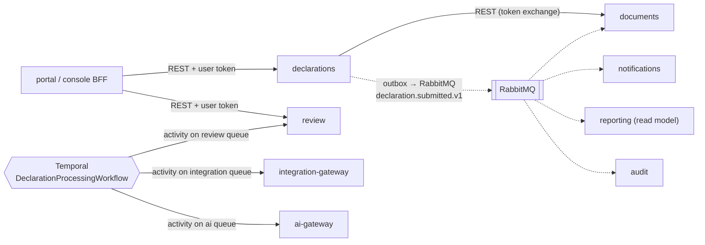

# ADR-013: Service-to-service communication

- **Status:** Accepted
- **Date:** 2026-09-24
- **Deciders:** Adili V3 DIALs team
- **Related:** [ADR-003](0003-temporal-as-workflow-engine.md), [ADR-004](0004-identity-keycloak-self-registration.md), [ADR-005](0005-message-queue-rabbitmq.md), [ADR-006](0006-multi-tenancy-and-hierarchy.md), [ADR-009](0009-api-first-interoperability.md), [ADR-012](0012-single-polyglot-monorepo.md)

## Context

~11 NestJS services plus the BFFs need to exchange queries, commands, facts and long-running processes. Requirements:
- Tenant context and the acting user must survive every hop (RLS, audit, "on behalf of").
- Statutory processes must not break when one service is slow or down.
- Contracts must be typed, versioned and testable (code quality).
- Nothing that needs a separate discovery server or service mesh for the hackathon.

## Decision

### 1. Three channels, one rule for choosing

| Need | Channel | Example |
|---|---|---|
| **Ask** something and need the answer now (query, or a command needing an immediate result) | **Synchronous HTTP/JSON (REST)** | console BFF → review: "list my queue"; declarations → documents: "presigned upload URL" |
| **Announce** that something happened (fact) | **Event via RabbitMQ** (outbox) | `declaration.submitted.v1` → documents issues the slip, notifications sends SMS, reporting updates counts, audit records |
| **Run a process** with several steps, deadlines, retries or compensation | **Temporal workflow** calling activities in the owning services | Submission processing, clarification timers, escalation ladder, Form M |

Default is **events**. Use synchronous calls only when the caller can't continue without the answer. Anything that waits days or chains more than two services goes to **Temporal**.

### 2. Synchronous calls

- **REST + JSON over HTTP**, the same style as the public API (ADR-009). Internal endpoints live under `/internal/v1` and are **never routed by the public Traefik entrypoint**.
- **Contracts:** OpenAPI 3.1 per service in `packages/schemas`. **Typed clients are generated** (`openapi-typescript` + `openapi-fetch`) into `packages/clients`, and requests and responses are validated with Zod at the boundary. CI fails on breaking contract changes (OpenAPI diff).
- **Discovery:** platform DNS (Docker Swarm service names on Dokploy; Kubernetes services in production). No discovery server.
- **Resilience defaults** in a shared HTTP client (`packages/api-kit`):
  - timeout 2s (configurable per call), deadlines propagated
  - retries only for idempotent requests (GET, or POST with `Idempotency-Key`), exponential backoff with jitter, max 2
  - circuit breaker per downstream (cockatiel)
- **Depth limit:** at most **one synchronous hop** from a service (BFF → service → one dependency). Deeper chains become events or Temporal.
- **Hot reference data** (tenants, org tree, policies, numbering schemes, reference data from `directory`) is **cached locally**: Valkey plus in-process cache, invalidated by `directory.*.changed.v1` events. Services don't call `directory` on every request.

### 3. Events

- As ADR-005: **transactional outbox → RabbitMQ → idempotent consumers (inbox)**, CloudEvents envelope, AsyncAPI-documented, versioned types.
- **Events carry IDs and non-sensitive facts, not financial content.** A consumer that needs details calls the owner's API under its own authorisation.
- **Local read models** instead of cross-service queries. For example, `reporting` builds its own projection of obligations and submissions from events to compute Form M. It never queries the `declarations` database.

### 4. Temporal orchestration

- Workflows live in the service that owns the process (ADR-003).
- **Each service hosts its activities on its own task queue** (`review`, `documents`, `integration`, `ai`, `notifications`). A workflow in `declarations` calls a `review` activity by task queue; Temporal delivers it, with retries and timeouts, and no HTTP call is needed.
- Activities are idempotent (keyed by workflow and activity ID) and write domain state in their own service's database.

### 5. Identity and tenant context on every hop

- **User-initiated calls:** the BFF calls services with the user's access token (audience = target service). A service calling another service **exchanges** it for a token scoped to the next service (Keycloak standard token exchange, RFC 8693). The chain keeps `sub` (the user), `act` (the calling service) and tenant claims, so RLS and audit work end to end.
- **System-initiated work** (workflows, consumers, schedulers): service-account tokens (client credentials), with the originating user or system reason carried in `act` / audit context.
- **Tenant context comes from verified token claims, never from plain headers.** The shared `data-access` library sets the RLS context from the validated token.
- **Transport:** internal Docker network in the demo; mTLS between services in production (service mesh optional).

### 6. Observability

`traceparent` is propagated through HTTP headers, AMQP message headers and Temporal headers (OpenTelemetry interceptors), so one trace follows a submission from the browser through every service, queue and workflow step.

### 7. Hard rules (checked in CI and review)

1. **No shared databases** and no cross-service database access. Each service owns its schema.
2. **No importing another service's code**; only `packages/*` (ADR-012 boundary rules).
3. No synchronous call chains longer than one hop from a service.
4. No sensitive financial data in events, logs or trace attributes.
5. Every command endpoint accepts an `Idempotency-Key`.

## Alternatives considered

| Option | Why not |
|---|---|
| gRPC internally | Faster and typed, but adds a protobuf toolchain next to the REST/OpenAPI we must publish anyway (ADR-009); harder to debug and to explain to EACC ICT teams. Performance isn't our bottleneck. |
| NestJS TCP/Redis microservice transports for request/response | Proprietary framing, weak contracts, no OpenAPI; ties callers to NestJS. |
| GraphQL federation between services | Heavy for this team and timeline; complex authorisation per field; REST + read models is simpler. |
| Everything via events (no sync calls) | Awkward for user-facing queries that need immediate answers. |
| Everything via sync calls | Tight coupling and cascading failures at the December peak. |
| Service mesh now (Istio/Linkerd) | Operational overhead for the demo; mTLS via mesh stays a production option. |

## Consequences

**Positive**
- Clear, teachable rule: *ask → REST, announce → event, process → Temporal*.
- Services keep working when a neighbour is slow (events, read models, circuit breakers).
- The user and tenant context survives every hop, so RLS and audit are correct end to end.
- Typed generated clients and contract diff checks make breaking changes visible.

**Negative / risks**
- Read models are eventually consistent (seconds). Acceptable for dashboards and Form M; user-facing confirmation comes from the owning service's response.
- Token exchange adds a Keycloak call per hop. Mitigated by caching exchanged tokens until expiry.
- Three channels means developers must choose correctly. Covered in the service template, code review and the rule table above.
