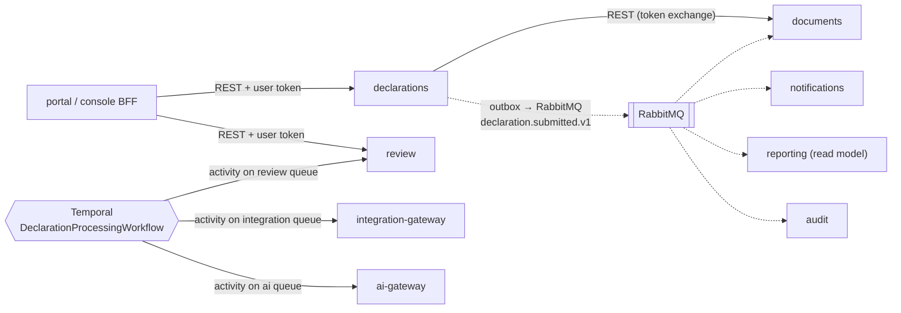

# ADR-013: Service-to-service communication

- **Status:** Accepted; amended 2026-09-28 with the recorded exceptions in §8 (spec #27, spec 03), 2026-10-01 with the reporting service's (§2 timeouts, §8.7; spec 09) and the access service's (§2 timeouts, §8.9, and the idempotency exceptions added to §8.2 and §8.3; spec 10), and 2026-10-02 with the review service's AI draft call (§2 timeouts; spec 07c), the ai-gateway's acting tenant (§8.8; spec 07c) and the integration-gateway's instructions to government systems (§8.10; specs 08, 09); the depth limit and default timeout in §2 and the acting-tenant uses in §8.1 partly superseded by [ADR-017](0017-obligation-reminder-delivery.md) for the declarations service's calls (spec 04)
- **Date:** 2026-09-24
- **Deciders:** Adili V3 DIALs team
- **Related:** [ADR-003](0003-temporal-as-workflow-engine.md), [ADR-004](0004-identity-keycloak-self-registration.md), [ADR-005](0005-message-queue-rabbitmq.md), [ADR-006](0006-multi-tenancy-and-hierarchy.md), [ADR-009](0009-api-first-interoperability.md), [ADR-012](0012-single-polyglot-monorepo.md)

## Context

~11 NestJS services plus the BFFs need to exchange queries, commands, facts and long-running processes. Requirements:
- Tenant context and the acting user must survive every hop (RLS, audit, "on behalf of").
- Statutory processes must not break when one service is slow or down.
- Contracts must be typed, versioned and testable (code quality).
- Nothing that needs a separate discovery server or service mesh for the hackathon.

## Decision

### 1. Three channels, one rule for choosing

| Need | Channel | Example |
|---|---|---|
| **Ask** something and need the answer now (query, or a command needing an immediate result) | **Synchronous HTTP/JSON (REST)** | console BFF → review: "list my queue"; declarations → documents: "presigned upload URL" |
| **Announce** that something happened (fact) | **Event via RabbitMQ** (outbox) | `declaration.submitted.v1` → documents issues the slip, notifications sends SMS, reporting updates counts, audit records |
| **Run a process** with several steps, deadlines, retries or compensation | **Temporal workflow** calling activities in the owning services | Submission processing, clarification timers, escalation ladder, Form M |

Default is **events**. Use synchronous calls only when the caller can't continue without the answer. Anything that waits days or chains more than two services goes to **Temporal**.

### 2. Synchronous calls

- **REST + JSON over HTTP**, the same style as the public API (ADR-009). Internal endpoints live under `/internal/v1` and are **never routed by the public Traefik entrypoint**.
- **Contracts:** OpenAPI 3.1 per service in `packages/schemas`. **Typed clients are generated** (`openapi-typescript` + `openapi-fetch`) into `packages/clients`, and requests and responses are validated with Zod at the boundary. CI fails on breaking contract changes (OpenAPI diff).
- **Discovery:** platform DNS (Docker Swarm service names on Dokploy; Kubernetes services in production). No discovery server.
- **Resilience defaults** in a shared HTTP client (`packages/api-kit`):
  - timeout 2s (configurable per call), deadlines propagated
  - retries only for idempotent requests (GET, or POST with `Idempotency-Key`), exponential backoff with jitter, max 2
  - circuit breaker per downstream (cockatiel)
- **Built so far:** `createServiceClient` in `packages/api-kit` wraps the generated client: the caller's client credentials token (§5), one retry after a 401 with a fresh token, the 2 s default timeout per attempt, and `call`, which validates the answer with Zod and turns everything the caller did not expect (no answer, another status, a body that breaks the contract) into the caller's own "unavailable" error. The directory's calls to documents (spec #27), notifications and the integration-gateway (spec 03) use it. **Not built yet:** retries with backoff and the circuit breaker; they land in `createServiceClient` with the first hop that needs them (the integration-gateway breaks its own upstream circuits, and roster file reads run in Temporal activities, whose retries cover transient failures).
- **Recorded timeout exceptions** (longer than the 2 s default, each with its reason):
  - directory → notifications `POST /internal/v1/messages` (onboarding codes): 6 s. The messages API is synchronous with a 5 s budget for its email or SMS provider (spec 03), and the declarant waits on the answer; the extra second covers the hop.
  - review → declarations `GET /internal/v1/declarations/{declarationId}/versions/{version}/document` and `.../previous-version` (spec 07a): 5 s. The document is one decrypted version; pulls for triage run in workflow activities, which retry, and a reviewer's case view shows the case without the document when it times out.
  - review → documents `POST /internal/v1/documents/issue` (clarification letters, spec 07a): 30 s. Rendering through Gotenberg and PAdES signing take seconds; it runs in a workflow activity, which retries, and issuing again answers the document already issued.
  - review → notifications `POST /internal/v1/messages` (clarification notices, spec 07a): 7 s. The messages API's 5 s provider budget plus the hop; sent from workflow activities, which retry under the same `Idempotency-Key`.
  - A reviewer's reads in review are bounded as a whole (service token, attempt and the retry after a 401 together), so review always answers before the console gives up: the declaration for the case view and the Registry tab within 5 s (else the case without it, or 502), the Registry tab's stored-result reads within 3 s together. The console waits 15 s for review, clearly longer than review's slowest read (8 s). Recorded after a slow declarations service made the console give up on the whole case at 10 s (spec 07a #164).
  - review → integration-gateway `POST /internal/v1/payroll/instructions` (salary stoppage and resumption, spec 08): 15 s. The gateway's payroll adapter answers within its own budget; instructions go out from workflow activities, which retry, and a replay of the same instruction reference answers the stored acknowledgement.
  - review → integration-gateway registry lookups (`POST /internal/v1/{kra,ntsa,brs,ardhisasa}/...-lookups`), `GET /internal/v1/brs/companies/{registrationNumber}/supplies` and `GET /internal/v1/verification-results/{resultId}` (registry cross-checks, spec 07b): 10 s. The gateway times each registry out at 2 s. Before the timeout starts, a lookup reserves the rate-limit slots of its usual calls together, waiting up to a second for them (KRA: two, the PINs and one PIN's compliance; KRA's burst is at least four, so a declarant's lookup and the spouse's after it never queue; a third person's may queue or be answered `rate-limited`, which the check's retries look up again); a further call (a second PIN's compliance) is charged to the limit without waiting, so neither the wait nor our own limit counts against the timeout or the circuit breaker; lookups run in the registry check's workflow activities, which look up again with backoff, and answers are cached, so a repeat costs the registry nothing. The Registry tab's result reads are bounded tighter, below.
  - review → ai-gateway `POST /internal/v1/tasks/draft-clarification` with `waitSeconds` (Draft with AI, spec 07c): 12 s. The reviewer waits for the draft; the gateway answers within the 10 s wait (`MAX_TASK_WAIT_SECONDS`), with the finished job or the job still running, which the console then polls, and the extra 2 s cover the hop. A retry carries the same `Idempotency-Key`, so it gets the same job. The service's other gateway calls only record or read a job and keep the 2 s default.
  - reporting (spec 09), all from Temporal activities that retry, except the ICMS push an EACC analyst waits on:
    - → notifications `POST /internal/v1/messages` (Form M reminders, chase, receipt): 7 s, the 5 s provider budget plus the hop; a retry carries the same `Idempotency-Key`, so nothing is sent twice.
    - → declarations `POST /internal/v1/obligations/details` and → review `POST /internal/v1/review/clarifications/details`: 10 s, a page is up to 1,000 records; review's `GET /internal/v1/review/referrals/{referralId}/icms-payload` shares the budget.
    - → integration-gateway `POST /internal/v1/icms/referrals`: 15 s; the gateway's adapter kit times ICMS out within it, and registration is idempotent by the referral reference.
    - → documents `POST /internal/v1/documents/issue` (Form M, receipt and NCR PDFs): 30 s, rendering through Gotenberg and PAdES signing take seconds; a retry carries the same `Idempotency-Key`.
  - access (spec 10), from Temporal activities that retry:
    - → notifications `POST /internal/v1/messages` (acknowledgements, notices to declarants, decisions, reminders): 7 s, the 5 s provider budget plus the hop; a retry carries the same `Idempotency-Key`.
    - → documents `POST /internal/v1/documents/issue` (access packages, nil letters, certified copies): 30 s, rendering, watermarking and PAdES signing take seconds; a retry carries the same `Idempotency-Key`.
    - → directory `POST /internal/v1/commissions/{slug}/roster/records/{recordId}/onboarding-invitations` (inviting an officer with no account to onboard, spec 10 decision 2): 13 s. The directory sends the invitation by email, then SMS, through notifications (6 s each, as for onboarding codes) before it answers, so this is a second hop behind the activity; the activity retries with the same `Idempotency-Key`, which the directory and notifications both honour, so nothing is sent twice.
- **Depth limit:** at most **one synchronous hop** from a service (BFF → service → one dependency). Deeper chains become events or Temporal.
- **Hot reference data** (tenants, org tree, policies, numbering schemes, reference data from `directory`) is **cached locally**: Valkey plus in-process cache, invalidated by `directory.*.changed.v1` events. Services don't call `directory` on every request.

### 3. Events

- As ADR-005: **transactional outbox → RabbitMQ → idempotent consumers (inbox)**, CloudEvents envelope, AsyncAPI-documented, versioned types.
- **Events carry IDs and non-sensitive facts, not financial content.** A consumer that needs details calls the owner's API under its own authorisation.
- **Local read models** instead of cross-service queries. For example, `reporting` builds its own projection of obligations and submissions from events to compute Form M. It never queries the `declarations` database.

### 4. Temporal orchestration

- Workflows live in the service that owns the process (ADR-003).
- **Each service hosts its activities on its own task queue** (`review`, `documents`, `integration`, `ai`, `notifications`). A workflow in `declarations` calls a `review` activity by task queue; Temporal delivers it, with retries and timeouts, and no HTTP call is needed.
- Activities are idempotent (keyed by workflow and activity ID) and write domain state in their own service's database.

### 5. Identity and tenant context on every hop

- **User-initiated calls:** the BFF calls services with the user's access token (audience = target service). A service calling another service **exchanges** it for a token scoped to the next service (Keycloak standard token exchange, RFC 8693). The chain keeps `sub` (the user), `act` (the calling service) and tenant claims, so RLS and audit work end to end.
- **System-initiated work** (workflows, consumers, schedulers): service-account tokens (client credentials), with the originating user or system reason carried in `act` / audit context.
- **Tenant context comes from verified token claims, never from plain headers.** The shared `data-access` library sets the RLS context from the validated token.
- **Transport:** internal Docker network in the demo; mTLS between services in production (service mesh optional).

### 6. Observability

`traceparent` is propagated through HTTP headers, AMQP message headers and Temporal headers (OpenTelemetry interceptors), so one trace follows a submission from the browser through every service, queue and workflow step.

### 7. Hard rules (checked in CI and review)

1. **No shared databases** and no cross-service database access. Each service owns its schema.
2. **No importing another service's code**; only `packages/*` (ADR-012 boundary rules).
3. No synchronous call chains longer than one hop from a service.
4. No sensitive financial data in events, logs or trace attributes.
5. Every command endpoint accepts an `Idempotency-Key`.

### 8. Recorded exceptions

Deviations from the rules above, each narrow, with the reason and the controls that keep it safe. Add new ones here; do not widen these.

**8.1 Acting tenant in a header on internal routes (§5).** A service doing system work for a tenant (the directory reading a Commission's roster upload from documents inside an import workflow) has no user token to exchange. It calls with its own client credentials token and names the tenant in `X-Acting-Tenant` (`ACTING_TENANT_HEADER` in `packages/api-kit`). The callee trusts the header only when all of these hold:
- the route is under `/internal/v1`, which the public entrypoint never routes;
- the verified token carries the service scope for that internal API (e.g. `documents:internal`), which only named service clients get; a user token is refused whatever headers it sends;
- the resource is still checked against the named tenant: another tenant's resource is 404, as if it did not exist;
- the header is validated as a tenant key, never `platform`.

So the header chooses among the tenants a trusted service may act for; it never grants access by itself. Today: documents' `GET /internal/v1/uploads/{id}/download` (`ActingTenantGuard`), called by the directory (`HttpRosterUploads`). Token exchange (§5) replaces this once system work carries an originating user or tenant claim.

**8.2 No `Idempotency-Key` on endpoints that return a secret, or revoke access (§7.5).** Creating, rotating and revoking a Commission's HR-system API credential (directory `/v1/commissions/{slug}/roster/api-credential`) take no key: the idempotency store keeps the response for replay, and the create and rotate responses carry the client secret, which the platform must never store. Retries stay safe without it: create is refused with 409 while a credential exists (a retry after a lost response is told to rotate or revoke), rotate issues a fresh secret (the lost one is useless), and revoke of a revoked credential is 404, leaving the same end state.

Revoking a law enforcement officer's account (directory `POST /v1/law-enforcement/officers/{officerId}/revoke`, spec 10) takes none either, because it is idempotent by the officer's state, decided under the officer's row lock: a retry finds the officer `revoked` and answers the account as it is, changing nothing in Keycloak and recording no second `lea.account.revoked.v1`. A revoke the identity provider failed (502 `identity-unavailable`) changed nothing, so retrying it is safe; one racing another change to the officer is refused with 409 `lea-officer-busy`.

**8.3 No `Idempotency-Key` on the onboarding steps before confirm (§7.5, spec 03).** The public onboarding API (directory `/v1/onboarding`, no bearer token) takes a key on the two steps whose effect cannot be told apart from a second one: confirm (creates the account) and resend-password-email (sends an email). There the key belongs to the session and the secret presented (a keyed hash of both, `SessionIdempotencyKey`), since there is no token `sub`, so only the secret's holder gets a stored answer back. The other steps take none:
- identify (`POST /v1/onboarding/sessions`) returns the session secret, which the idempotency store must not keep (as in 8.2). A retry just opens a fresh session (the lost one lapses at its expiry, 30 minutes), and it is rate limited per client IP and per client IP and Commission;
- verify, resend and provide-contact (`/otp/{channel}/verify`, `/otp/{channel}/resend`, `/contacts`) each move the session's state machine one step, scoped by the session id and secret. A replay is refused by the state check (409 `wrong-step` once the step is done), by the one-minute resend cooldown (429 `resend-cooldown`), or counts as one more attempt against the code's five, never as a second effect.

Applicant onboarding (directory `/v1/onboarding/applicants`, spec 10) follows the same split: complete (creates the person and the account) and resend-password-email take the session's key, and the steps before complete take none, for the same reasons:
- start (`POST /v1/onboarding/applicants`) returns the session secret, as identify does. A retry opens a fresh session (the lost one lapses at its expiry), and starts use up identify's per-IP rate limit;
- verify and resend of the phone's code (`/{sessionId}/otp/verify`, `/{sessionId}/otp/resend`) move the session one step, scoped by its id and secret. A replay gets 409 `wrong-step` or 429 `resend-cooldown`, or counts as one of the code's five attempts (and resends stop at three), never as a second effect.

**8.4 No `Idempotency-Key` on reopening and discarding an amendment (§7.5, spec 06).** The declarations service's `POST /v1/declarations/{id}/amend` and `POST /v1/declarations/{id}/amend/discard` take no key. Each answers with the declaration and its `ETag`, which a client needs for its next section save (`If-Match`); the idempotency store keeps only status and body, so a replay would answer without it. Neither needs a key to be safe to retry, because each is idempotent by the declaration's state, decided under its row lock: a retried amend finds the declaration `amending` and answers it as it is, copying nothing and recording no second `declaration.amendment-started.v1`; a retried discard finds it `submitted` and answers it as it is. Two requests at once make one change and one event.

**8.5 Acting tenant on the acknowledgement slip's internal routes (§5, spec 06).** The routes below take the tenant in `X-Acting-Tenant` from a service's client credentials token, each under every control of 8.1 (`InternalApi(scope)` and `@ActingTenant()` from `packages/api-kit`; the resource checked against the named tenant, 404 otherwise):
- declarations' `GET /internal/v1/declarations/{declarationId}/versions/{version}/acknowledgement-payload` (scope `declarations:internal`, audited), pulled by the documents service's acknowledgement issuer, an event consumer with no user token, after `declaration.submitted.v1` or `declaration.acknowledgement-requested.v1`;
- documents' `POST /internal/v1/documents/issue` and `POST /internal/v1/documents/{documentId}/supersede` (scope `documents:internal`), how a service issues a document for the tenant it names and supersedes one of its documents. The documents service's own acknowledgement issuer issues in process; review (8.6), reporting (8.7) and access (8.8) call `issue` over HTTP;
- documents' `POST /internal/v1/uploads/{id}/linked` (scope `documents:internal`), called by declarations when it links an attachment to an item and when a discarded amendment links one again.

**8.6 Acting tenant on the review service's internal calls and routes (§5, spec 07a).** Each under every control of 8.1 (`InternalApi(scope)` and `@ActingTenant()` from `packages/api-kit` on the callee; the resource checked against the named tenant, 404 otherwise):
- review calls, with its own client credentials token and the Commission in `X-Acting-Tenant`: declarations' `GET /internal/v1/declarations/{declarationId}/versions/{version}/document` (scope `declarations:internal`; the read also names the staff subject in `X-Acting-Subject` and the case in `X-Review-Case`, which declarations records in its audit event), `GET /internal/v1/declarations/previous-version`, `GET /internal/v1/obligations/{obligationId}` and `GET /internal/v1/persons/{personId}/obligations` (spec 08); the directory's `GET /internal/v1/commissions/{slug}/policy`, `GET /internal/v1/commissions/{slug}` and `GET /internal/v1/commissions/{slug}/roster/records/{recordId}` (`directory:internal`), and that record's `GET .../national-id` (`directory:roster-national-id`, a scope of its own held by review alone: payroll's salary stoppage, the ICMS referral and the registry cross-checks identify the officer by it); documents' `GET /internal/v1/uploads/{id}/download`, `POST /internal/v1/documents/issue`, `POST /internal/v1/documents/{documentId}/revoke`, `GET /internal/v1/documents/{documentId}` and `GET /internal/v1/documents/{documentId}/download` (`documents:internal`). The last is how staff read a letter the review service issued: documents' public download serves only the person a document is about, so a reviewer's "Download PDF" on a clarification letter goes to review (`GET /v1/review/clarifications/{clarificationId}/letter/download`), which checks the clarification is visible to the reviewer, asks documents for the link for the Commission (one hop) and audits the read naming the declarant (ADR-008); documents audits its own hand-out under the Commission, naming the same person. Payroll instructions to the integration-gateway name the employer in the body and act for no tenant. Registry lookups, supplier checks and stored results (scope `registry`, spec 07b) act for the Commission in `X-Acting-Tenant`, which encrypts the stored answer, with `X-Legal-Basis` and the case in `X-Case-Ref`; national IDs travel in the body, never the URL. The registries' configured rate limits (`GET /internal/v1/registry-rate-limits`, scope `registry`), which review's hourly sweep paces itself under, take the scope alone, as in ADR-017: configuration, no tenant to act for. Its messages to notifications carry the tenant in the body, as every caller's do, not in the header. The reads in a reviewer's request (case view, issuing a clarification) carry that reviewer as `X-Acting-Subject`; triage in workflows carries `system:review`.
- review's own routes (scope `review:internal`): `GET /internal/v1/review/clarifications/{clarificationId}/letter-payload`, served from the letter review fixed when it issued the clarification, so it calls no other service (§7.3); the decision and action letter payloads (`/determinations/{determinationId}/letter-payload`, `/actions/{actionId}/letter-payload`) and the referral package payload (`/referrals/{referralId}/package-payload`, audited), all pulled by the documents service when it renders them (spec 08); and `GET /internal/v1/review/referrals/{referralId}/icms-payload` (audited), pulled by reporting when an EACC analyst pushes a referral to ICMS (spec 09).
- **`X-Acting-Subject`.** On the same internal routes, a service reading for a person names them in `X-Acting-Subject`: review naming the reviewer to declarations, and to documents on the upload and issued-document downloads (the declarant, as `person:<id>`, when their response's attachments are checked), reporting naming the EACC analyst to review. The callee records it as the actor's `on-behalf-of` in the read's audit event (ADR-008) and grants nothing on it; `AuditedReadInterceptor` in `packages/events` reads it (and `X-Acting-Tenant`) only once `InternalApi(scope)` admitted the call, a service token with the route's internal scope, so no other caller can name whom it acts for.

Token exchange (§5) replaces these with 8.1's.

**8.7 Acting tenant and acting subject on the reporting service's internal calls (§5, spec 09).** The reporting service compiles each Commission's Form M, issues its documents and chases it from Temporal activities and event consumers, with no user token to exchange. It calls with its own client credentials token, through clients generated from the callees' contracts, and names the Commission in `X-Acting-Tenant` on these routes, each under every control of 8.1 (the path slug, when there is one, must equal the header; another Commission's resource is 404, or left out of a batch):
- directory's `GET /internal/v1/commissions/{slug}` and `GET /internal/v1/commissions/{slug}/staff?role=` (scope `directory:internal`): the Commission's name and issuer code for Form M Part I and its reference, and the staff a reminder or the chase is emailed to. The list of every Commission, `GET /internal/v1/commissions`, takes the scope alone, as in ADR-017: public reference data, no tenant to act for, never `platform`;
- declarations' `POST /internal/v1/obligations/details` (scope `declarations:internal`) and review's `POST /internal/v1/review/clarifications/details` (scope `review:internal`): batch reads naming the officers on Form M's non-filer and clarification rows;
- documents' `POST /internal/v1/documents/issue` (8.5), for the Form M, receipt and NCR PDFs;
- review's `GET /internal/v1/review/referrals/{referralId}/icms-payload` (scope `review:internal`), read when an EACC analyst pushes a referral to ICMS. It also names the analyst in `X-Acting-Subject`, as declarations' internal document reads name the officer for review: review's audit of the read records who caused it. The header is trusted on the same terms as the acting tenant (internal route, service scope, never a grant by itself) and only names; it widens nothing the token may read.

Notifications' `POST /internal/v1/messages` and the gateway's ICMS routes take no acting tenant: the message carries its `tenant` for audit and branding, and ICMS registrations are keyed by the referral reference. Token exchange (§5) replaces these with 8.1's once system work carries an originating user or tenant claim.

**8.8 Acting tenant on the ai-gateway's internal routes (§5, spec 07c).** The review service runs the reviewer copilot's AI tasks from Temporal activities and event consumers (the summary and explanations after triage, a job's outcome on `ai.job.*`) as well as in a reviewer's request (Draft with AI, a rating), always with its own client credentials token, and names the Commission in `X-Acting-Tenant`. The gateway's internal routes take the tenant from that header under every control of 8.1 (`InternalApi('ai')` and `@ActingTenant()` from `packages/api-kit`; a user token is refused whatever it sends), never from the request body:
- `POST /internal/v1/tasks/{task}`: the job is the named tenant's; its routing, classification gate, budget and rate limit are that tenant's. The body carries no tenant;
- `GET /internal/v1/jobs/{jobId}` and `PUT /internal/v1/jobs/{jobId}/feedback`: the caller's own job of the named tenant, else 404, as if it did not exist;
- `GET /internal/v1/tenants/{tenant}/status`: the path tenant must equal the header, else 404.

Token exchange (§5) replaces this with 8.1's once system work carries an originating user or tenant claim.

**8.9 Acting tenant and acting subject on the access service's internal calls (§5, spec 10).** The access service runs Form K requests, law enforcement requests and certified copies from Temporal activities, and from requests by applicants, law enforcement officers, declarants and access officers whose tokens it does not exchange. It calls with its own client credentials token, through clients generated from the callees' contracts, and names the Responsible Commission in `X-Acting-Tenant` on these routes, each under every control of 8.1 except where said below:
- directory, scope `directory:internal`: `GET /internal/v1/commissions/{slug}` and the list of every Commission (no acting tenant, as in 8.7); `GET /internal/v1/commissions/{slug}/policy` (`internalGetTenantPolicy`), the Commission's access periods (decision, representation and download windows, spec 10 decision 3); a roster record (`GET /internal/v1/commissions/{slug}/roster/records/{recordId}`) and the roster search (`GET .../roster/records?search=`), to resolve the officer a request names; `POST .../roster/records/{recordId}/onboarding-invitations` (with an `Idempotency-Key`), inviting an officer resolved with no account to onboard (spec 10 decision 2); and `GET /internal/v1/commissions/{slug}/staff?role=`, for reminders to the Commission's access officers;
- directory, scope `directory:applicants` (the `access` client alone): `GET /internal/v1/applicants/{personId}` (`internalGetApplicant`), the applicant's particulars and identity status for Form K, and `POST .../identity-verification` (`internalVerifyApplicantIdentity`, with an `Idempotency-Key`), the record of an access officer's check of a passport applicant;
- directory, scope `directory:law-enforcement` (the `access` client alone): `GET /internal/v1/law-enforcement/officers/{personId}` (`internalGetLeaOfficer`), the officer's agency, Keycloak account and its state, against which access records a request's provenance (r.23(1));
- declarations, scope `declarations:disclosures` (the `access` client alone): `POST /internal/v1/declarations/disclosures` (`internalRenderDisclosure`), the scoped disclosure for a grant, and `POST /internal/v1/declarations/{declarationId}/versions/{version}/full-document` (`internalGetFullDocumentForCertifiedCopy`), a version in full for a certified copy, with the declarant and the recipient (the declarant, or their representative) in the body, so no name travels in a URL or header (a read, so no `Idempotency-Key`). Both are audited as disclosures (ADR-008), with the legal basis, the recipient and the versions served. Both name in `X-Acting-Subject` who caused the read (the access officer who decided the grant; for a certified copy, the declarant, or the access officer recording a written application), trusted on 8.6's terms: it is recorded as `on-behalf-of` and grants nothing;
- review, scope `review:disclosures` (the `access` client alone): `POST /internal/v1/review/clarifications/disclosures` (`internalDiscloseClarifications`), the clarifications a Form K grant that includes them discloses with the declarations, of the declarations its disclosure served, cut to the granted household members and sections. Audited as a disclosure like declarations' (legal basis, grant reference, recipient, the clarifications served), with the deciding access officer in `X-Acting-Subject` on the same terms (a read, so no `Idempotency-Key`);
- declarations `POST /internal/v1/declarations/disclosure-counts` (`internalCountDisclosure`, scope `declarations:disclosures`) and review `POST /internal/v1/review/clarifications/disclosure-counts` (`internalCountClarificationDisclosure`, scope `review:disclosures`): what a scope under decision holds, as counts only, for the access officer's preview before a grant (spec 10 decision 1). Each names the access officer or supervisor viewing it in `X-Acting-Subject`, on 8.6's terms, and audits the count with the legal basis, the reference and that viewer as recipient (reads, so no `Idempotency-Key`);
- declarations, scope `declarations:internal`: `GET /internal/v1/persons/{personId}/declaration-versions` (`internalListPersonVersions`, audited), a person's submitted versions at the Commission, without content, for the access officer recording a written self-access application;
- documents, scope `documents:internal`: `POST /internal/v1/documents/issue` (8.5) for access packages and certified copies, and, for representation attachments and proofs, `GET /internal/v1/uploads/{id}`, `GET .../download`, `POST .../linked` and `POST .../unlinked`. `issue` takes `additionalDownloaders`: at most ten token subjects of the issuing Commission's staff who may download the document besides its subject person (the access officer who hands over an in-person certified copy). The public download routes admit such a caller only with a token of the issuing Commission whose `sub` is listed; anyone else is 404, as before.

Applicants and law enforcement officers belong to no Commission: any person may ask any Responsible Commission for a declaration (Act s.36(1)), and an officer, provisioned for an agency by a platform admin (token tenant `lea`), may ask any of them (s.36(2)). So the acting tenant cannot scope their records as it scopes a declarant's, and two routes widen 8.1's "another tenant's resource is 404":
- the directory's `GET /internal/v1/persons/{personId}/contacts` (notifications, `directory:person-contacts`) answers a law enforcement officer's or an applicant's contacts whatever the acting tenant, since every Commission's acknowledgements, notices and decisions reach them. A declarant is still 404 unless onboarded at the acting tenant;
- `internalGetLeaOfficer` accepts any `X-Acting-Tenant` (as do `internalGetApplicant` and `internalVerifyApplicantIdentity`): the person is read in the platform context, and the header names, for the audit trail, the Commission the request is addressed to. Only an id that is no such person is 404.

The scopes keep these narrow: `directory:applicants`, `directory:law-enforcement`, `declarations:disclosures` and `review:disclosures` are held by the `access` client alone, and `directory:person-contacts` by `notifications` alone (`pnpm keycloak:check` fails otherwise). Notifications' `POST /internal/v1/messages` takes no acting tenant, as in 8.7. Token exchange (§5) replaces these with 8.1's once system work carries an originating user or tenant claim.

**8.10 No `Idempotency-Key` on the integration-gateway's instructions to government systems (§7.5, specs 08 and 09).** Payroll instructions (`POST /internal/v1/payroll/instructions`, scope `payroll`) and ICMS referrals (`POST /internal/v1/icms/referrals`, scope `icms`) take no key: each is idempotent by the reference it carries (the `ADM` instruction reference, the `RFL` referral reference), which the upstream system is idempotent by too. The same reference again answers the stored acknowledgement or registration (200) without calling the system (a pending payroll acknowledgement is asked again; while payroll does not answer, its stored pending acknowledgement, 200); the same reference with other particulars (another officer, action or date; another declarant or Commission) is 409. A key would add nothing a retry needs, and the gateway stores no personal data for a replay: the officer's or declarant's national ID only as a keyed hash, no name.

## Alternatives considered

| Option | Why not |
|---|---|
| gRPC internally | Faster and typed, but adds a protobuf toolchain next to the REST/OpenAPI we must publish anyway (ADR-009); harder to debug and to explain to EACC ICT teams. Performance isn't our bottleneck. |
| NestJS TCP/Redis microservice transports for request/response | Proprietary framing, weak contracts, no OpenAPI; ties callers to NestJS. |
| GraphQL federation between services | Heavy for this team and timeline; complex authorisation per field; REST + read models is simpler. |
| Everything via events (no sync calls) | Awkward for user-facing queries that need immediate answers. |
| Everything via sync calls | Tight coupling and cascading failures at the December peak. |
| Service mesh now (Istio/Linkerd) | Operational overhead for the demo; mTLS via mesh stays a production option. |

## Consequences

**Positive**
- Clear, teachable rule: *ask → REST, announce → event, process → Temporal*.
- Services keep working when a neighbour is slow (events, read models, circuit breakers).
- The user and tenant context survives every hop, so RLS and audit are correct end to end.
- Typed generated clients and contract diff checks make breaking changes visible.

**Negative / risks**
- Read models are eventually consistent (seconds). Acceptable for dashboards and Form M; user-facing confirmation comes from the owning service's response.
- Token exchange adds a Keycloak call per hop. Mitigated by caching exchanged tokens until expiry.
- Three channels means developers must choose correctly. Covered in the service template, code review and the rule table above.
