# Adili Online V3 - DIALs Platform Architecture

**Track 3: Declaration of Income, Assets and Liabilities (DIALs)**
Version 0.1 · 2026-09-24 · Owner: Adili V3 DIALs team

This is the team's shared architecture reference. Decisions are recorded as ADRs in [`docs/adr`](../adr); research and sizing are in [`docs/research`](../research); requirements traceability is in [`docs/requirements`](../requirements); terms and codes are in the [glossary](../glossary.md). Start at the [docs index](../README.md).

---

## Contents

1. [Problem and scope](#1-problem-and-scope)
2. [Architecture principles](#2-architecture-principles)
3. [System context](#3-system-context)
4. [Containers and services](#4-containers-and-services)
5. [Key flows](#5-key-flows)
6. [Data architecture](#6-data-architecture)
7. [Multi-tenancy and access model](#7-multi-tenancy-and-access-model)
8. [Security and privacy](#8-security-and-privacy)
9. [AI architecture](#9-ai-architecture)
10. [Interoperability](#10-interoperability)
11. [Scalability](#11-scalability)
12. [Deployment](#12-deployment)
13. [Backup, recovery and redundancy](#13-backup-recovery-and-redundancy)
14. [Observability](#14-observability)
15. [Technology stack](#15-technology-stack)
16. [Repository and engineering standards](#16-repository-and-engineering-standards)
17. [ADR index](#17-adr-index)
18. [Open questions for EACC](#18-open-questions-for-eacc)

---

## 1. Problem and scope

Under the **Conflict of Interest Act, 2025** (s.31-40) and the **Conflict of Interest Regulations, 2026**, **every public officer** in Kenya must declare their income, assets and liabilities, plus those of their spouse(s) and dependent children under 18:

- **Initial:** within 30 days of appointment
- **Biennial:** statement date 1 November, filed by 31 December (odd years; next cycle **Dec 2027**)
- **Final:** within 30 days of leaving office

Declarations go to the officer's **responsible Commission** (~160 bodies, s.32 and Reg 5). The Commission then:
- analyses, verifies and requests clarifications (s.35)
- takes administrative action for non-compliance, up to **salary stoppage** (Admin Mechanisms, Aug 2026)
- reports to EACC in **Form M** by 31 July (Reg 25)

EACC oversees, consolidates nationally and pursues referrals (Reg 20). Access by the public (Form K) and law enforcement (Reg 23) is controlled.

| Scale driver | Figure |
|---|---|
| Declarants (design target) | **1.5M** (KNBS: 1.07M public sector + police, KDF, NIS, State officers) |
| Financial statements per cycle | ~4-5M (officer + spouses + children) |
| Responsible Commissions (tenants) | ~160, plus PSC delegates |
| Reporting entities (employers) | tens of thousands |
| **2027 triple peak** | Resignations for candidates by 9 Feb → general election 10 Aug (all elected officers file final + initial) → biennial cycle Nov-Dec |

Full analysis: [research/dials-scope-and-scale.md](../research/dials-scope-and-scale.md).

**Functional scope** (from the EACC user stories, Act, Regulations and Admin Mechanism 37):

| Area | Capabilities |
|---|---|
| Declarant | Roster-matched self-onboarding; bio data pre-fill; declaration type derived automatically; household; per-person financial statements; document upload with AI pre-fill; material-change comparison; sign and submit; acknowledgement with QR; clarification responses; "who accessed my declaration" |
| Responsible Commission | Roster import and upkeep; review queues; deterministic + AI-assisted analysis; clarifications; compliance determinations; administrative actions (incl. payroll instructions); referrals; Form M |
| EACC | Form M intake and analysis; national consolidation; non-compliance reporting to ICMS; oversight dashboards; open data |
| Access | Form K requests with declarant representations; law enforcement requests; watermarked disclosure packages |
| Cross-cutting | Multi-tenancy with delegations; reference numbers; verifiable documents; tamper-evident audit; notifications; public and agency APIs |

---

## 2. Architecture principles

1. **Law as the spec.** Every capability traces to a section of the Act or Regulations, the Admin Mechanisms or an EACC user story.
2. **Sovereign by default.** Self-hosted in Kenya. External AI is behind a replaceable port and a data-classification gate (ADR-007).
3. **Least privilege, provable.** Isolation enforced in the token, the service and the database (row-level security), and backed by tests.
4. **Everything is evidence.** Every read and write is audited, hash-chained and anchored (ADR-008). Every outgoing document is verifiable (ADR-010).
5. **API-first.** Our portals use the same public APIs that Commissions and agencies use (ADR-009).
6. **Right-sized.** Choices backed by numbers; PostgreSQL for all structured data (ADR-001). Growth paths documented, not pre-built.
7. **AI assists, humans decide.** AI extracts, explains and drafts; deterministic code checks; named officers decide.
8. **Configuration over code for law and policy.** Deadlines, escalation ladders, category rules and numbering are versioned data.

---

## 3. System context

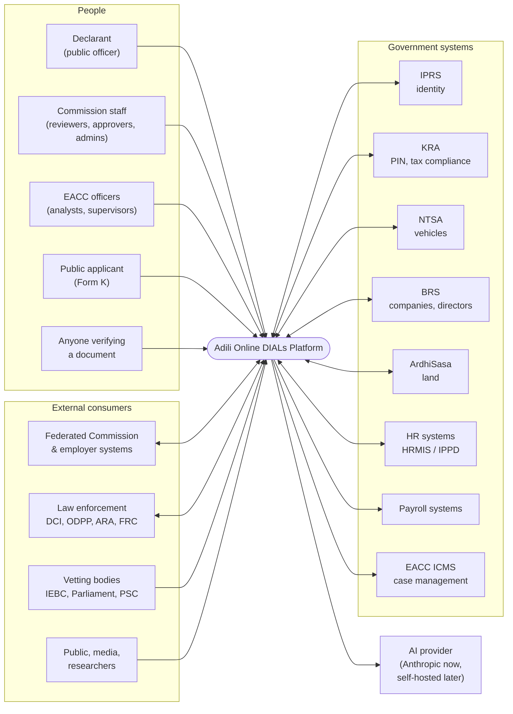

In the hackathon, all government systems are **Django mock services** seeded with consistent synthetic data, including planted discrepancies for the demo.

---

## 4. Containers and services

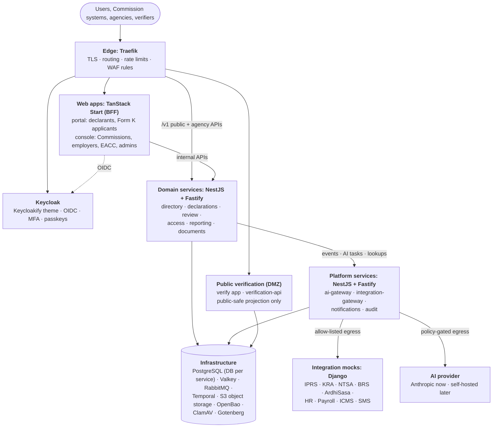

### Service responsibilities

| Service | Owns (data) | Key responsibilities | Temporal workflows hosted |
|---|---|---|---|
| **directory** | tenants, org_units (ltree), people, employments, rosters, delegations, category rules, policy versions, numbering registry, reference data | Declarant onboarding (roster match, OTPs, Keycloak account); roster import and validation; Commission provisioning | - |
| **declarations** | filing obligations, drafts, declarations, versions (JSONB snapshots), household, statements, items, material changes | Obligation tracking; autosave (Valkey write-behind); submit as one transaction; cross-tenant comparison ("compare, don't show") | `FilingObligationWorkflow`, `DeclarationProcessingWorkflow` |
| **review** | review cases, risk flags, clarifications, determinations, administrative actions, referrals | Deterministic rules (completeness, ±25%, income vs assets, cross-checks); reviewer queues; separation of duties | `ClarificationWorkflow` |
| **access** | access requests (Form K), LEA requests, representations, decisions, grants | Declarant notification and representations; decisions with Reg 24 grounds; watermarked packages | `AccessRequestWorkflow` |
| **reporting** | Form M reports, national consolidation, read models, open-data aggregates | Auto-compiled Form M; EACC intake and consolidation; dashboards; open data with small-group suppression | `ComplianceReportWorkflow`, `NationalConsolidationWorkflow` |
| **documents** | document refs, scan results, templates, issued documents, verification records | Presigned uploads → quarantine → ClamAV → clean; PDF issuance (Gotenberg), PAdES signing, QR, verification records | - |
| **verification-api** | read-only projection of verification records | Public verification (DMZ); no access to other data | - |
| **ai-gateway** | AI call log, prompt versions, routing table | Task API; provider adapters; data-classification gate; minimisation; injection defence; budgets | - |
| **integration-gateway** | verification results cache | Adapters to IPRS, KRA, NTSA, BRS, ArdhiSasa, HR, payroll, ICMS; retries, circuit breakers, per-system rate limits | - |
| **notifications** | notifications, templates, webhook subscriptions and deliveries | Email, SMS, in-app; staggered reminders; signed outbound webhooks | - |
| **audit** | audit events (partitioned), chain heads, anchors | Batched ingest; hash chains; daily signed anchors; verifier; audit queries; "who accessed my declaration" | - |

### Service communication (ADR-013)

| Need | Channel |
|---|---|
| **Ask** (query, or a command needing an immediate answer) | Synchronous REST/JSON on `/internal/v1`, generated typed clients, 2s timeouts, circuit breakers, **max one hop** |
| **Announce** (a fact happened) | Event: outbox → RabbitMQ → idempotent consumers; consumers keep **local read models** |
| **Process** (multi-step, deadlines, retries) | Temporal workflow; activities run on each owning service's task queue |

- The user's token is exchanged at each hop (RFC 8693), so `sub`, `act` and tenant claims reach RLS and audit.
- `traceparent` is carried through HTTP, AMQP and Temporal.
- No shared databases; no importing another service's code.

**Service runtime.** Every service is a NestJS **hybrid application** (NestJS microservices guideline): one process serves Fastify HTTP (`/v1`, `/internal/v1`, `/health/*`, `/docs`) and consumes its RabbitMQ queue through the Nest RMQ transport. Each service has one durable quorum queue, `<service>.events`, bound to the `adili.events` topic exchange once per `@OnEvent('<type>')` handler, with a per-service dead-letter queue. Publishing goes through the transactional outbox, relayed with the Nest RMQ `ClientProxy`.

**Common shared libraries** (`packages/`, used by every service):
- `api-kit`: service bootstrap (hybrid app), config validation, bearer-token auth with roles or scopes (`@Roles`, `@Scopes`), per-client and per-IP rate limits (`@RateLimit`, token buckets in Valkey), RFC 9457 problem details with a typed `code` from one registry (`PROBLEM_CODES`), health endpoints, `Idempotency-Key` handling (`@RequireIdempotencyKey()`, `idempotency_keys` table per service)
- `data-access`: Drizzle + `pg`, migrations, tenant context for row-level security, field cipher (AES-256-GCM envelope encryption with per-tenant OpenBao Transit keys, fake for tests)
- `events`: CloudEvents envelope, outbox relay, inbox (idempotent consumers), RMQ topology, `@OnEvent`
- `temporal`: Temporal client, worker module (workflows + Nest-provided activities on a task queue, readiness, drain on shutdown), time-skipping test helper
- `numbering`: reference numbers (ADR-011): gapless counters allocated in the caller's transaction, ISO 7064 MOD 37-36 check characters, format and parse per scheme
- `cache`: Valkey client and readiness
- `telemetry`: OpenTelemetry preload
- `bff-auth`: OIDC sign-in and server-side sessions for the portal and console BFFs
- `schemas`: external-system contracts (OpenAPI)
- `ui`: design system shared by the apps and the Keycloak theme
- Added with the features that need them: `authz` (CASL policies), `audit-client`, `numbering`, `clients` (generated internal API clients)

---

## 5. Key flows

### 5.1 Roster-matched self-onboarding (ADR-014)

The Commission's reporting officer has already imported the roster (file upload or roster API).

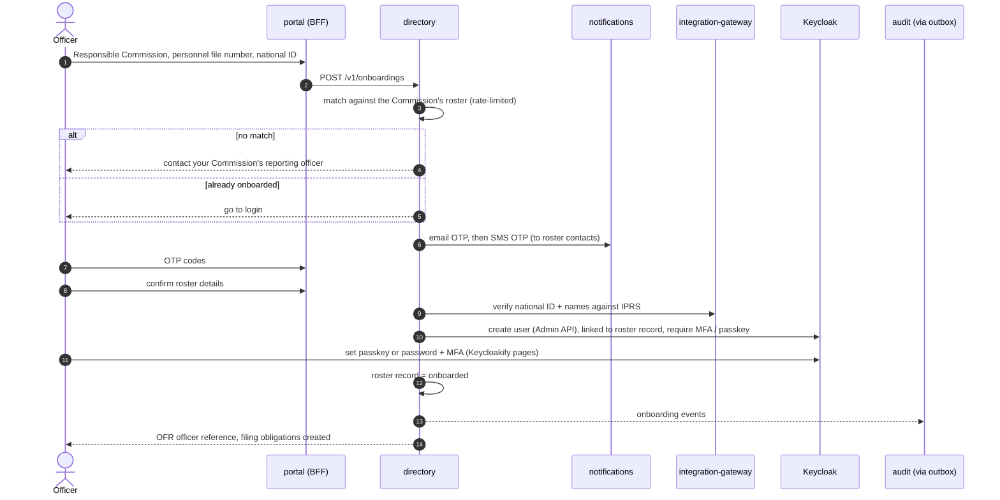

### 5.2 Filing and submitting a declaration

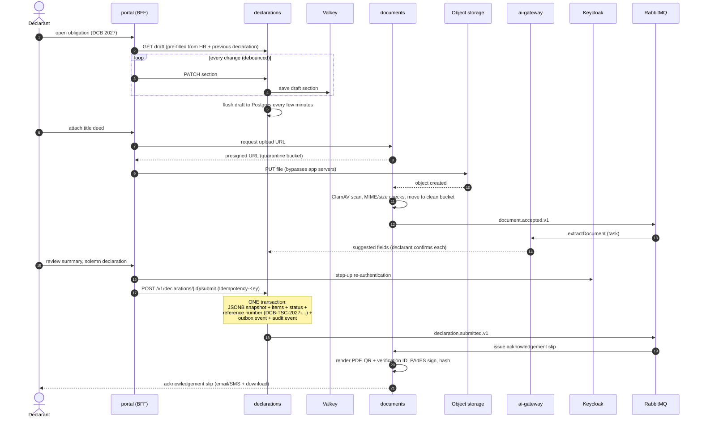

### 5.3 Post-submission processing (Temporal)

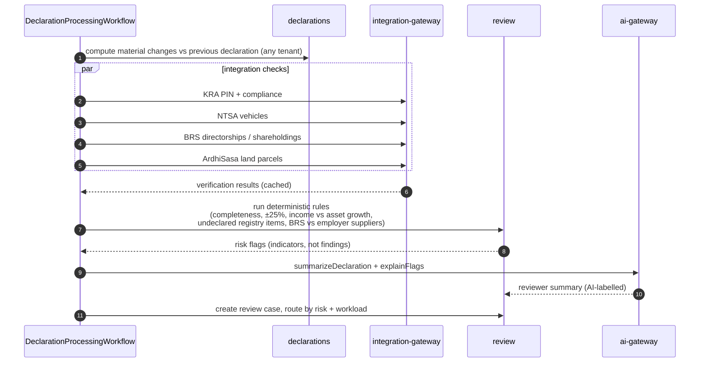

### 5.4 Clarification, determination and administrative action

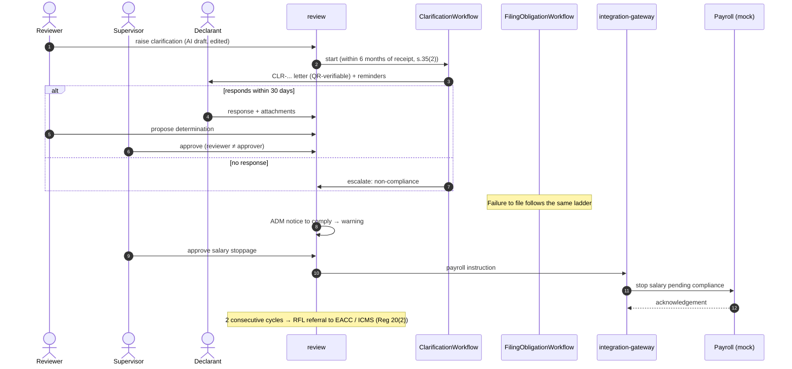

### 5.5 Form M and national consolidation

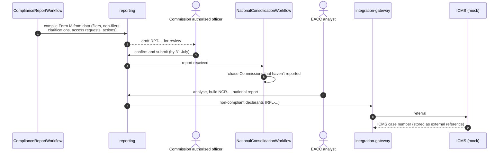

### 5.6 Access to a declaration (Form K / law enforcement)

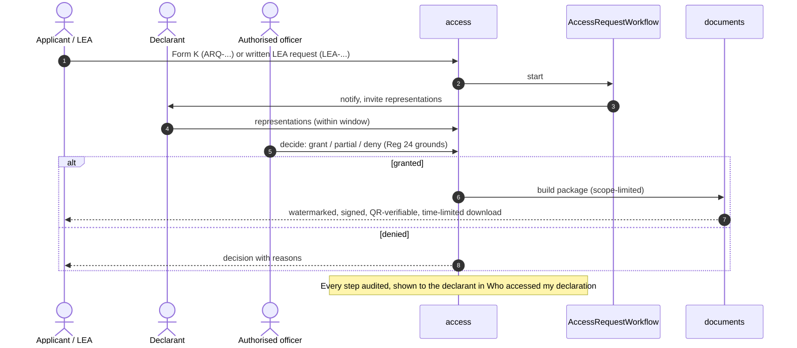

### 5.7 Document verification (ADR-010)

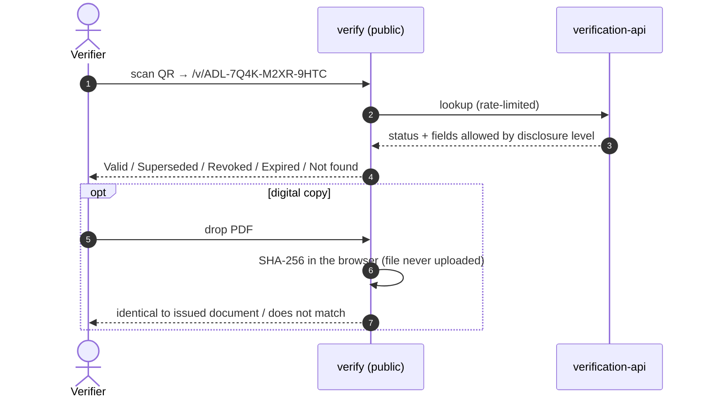

---

## 6. Data architecture

| Store | Holds | Key design |
|---|---|---|
| **PostgreSQL** (ADR-001) | All structured data, one database per service | JSONB legal snapshot per declaration version + normalised items; partitioned by cycle; audit partitioned by month; RLS by tenant |
| **Valkey** | Draft sections, sessions, rate limits, reference-data cache | Write-behind to Postgres; evicted after inactivity |
| **Object storage** (ADR-002) | Uploads, generated PDFs, exports, audit archives | Presigned uploads; quarantine → clean; versioning; object lock for legal records and audit archive |
| **RabbitMQ** (ADR-005) | Domain events in transit | Outbox/inbox, CloudEvents, DLQ |
| **Temporal** (ADR-003) | Workflow state and timers | Own Postgres DB; not the source of truth |

**Volume (design target, per biennial cycle):**

| | Per cycle | 10 years |
|---|---|---|
| Structured data (Postgres) | ~500GB | ~2.2TB (half is audit) |
| Core legal data | ~140GB | |
| Documents (object storage) | ~7.5TB | ~40TB |
| Peak Postgres ingest | ~2MB/s nominal, ~20MB/s at 10x | |

Details: [research/database-sizing.md](../research/database-sizing.md).

**Data classification:**

| Class | Examples | Handling |
|---|---|---|
| Public | Glossary, open-data aggregates, public verification fields | Cacheable, no auth |
| Internal | Reference data, policy versions, workflow metadata | Authenticated staff |
| Confidential | Bio data, employment, household members, access requests | Tenant-scoped RLS, audited reads |
| **Highly confidential** | Financial statements (amounts, accounts, parcels), documents, LEA requests | + field-level envelope encryption with per-tenant keys (OpenBao); never in logs, events or AI prompts without the classification gate |

**Retention:** declarations and clarifications for at least 5 years after the officer leaves (s.37). Audit archives are kept at least as long. Drafts are deleted after submission.

---

## 7. Multi-tenancy and access model

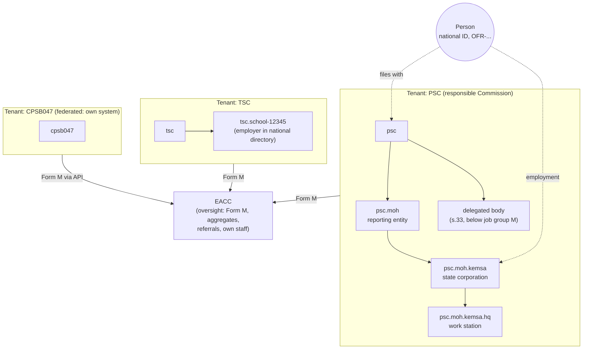

- **Tenant = responsible Commission.** Types: *hosted* (uses our portals) or *federated* (own system, integrates via API). (ADR-006)
- **Isolation in 4 layers:** token claims → CASL service policy (tenant + `ltree` scope + classification) → Postgres RLS (`SET LOCAL`, `FORCE ROW LEVEL SECURITY`) → CI tests proving cross-tenant access fails.
- **EACC is not a super-tenant:** aggregates and Form M by default. Individual declarations only through referrals or Reg 23 requests.
- **Transfers:** "compare, don't show". The new Commission sees computed material changes, not the previous declaration.

**Roles (initial set):**

| Role | Scope | Can | Cannot |
|---|---|---|---|
| Declarant | Own records | File, respond, view history and access log | See others |
| Reporting officer | Tenant | Import and maintain the roster, resolve onboarding no-matches | See financial content |
| Reviewer | Tenant / subtree | Review, raise clarifications, propose determinations | Approve own proposals |
| Supervisor / approver | Tenant / subtree | Approve determinations and actions | Review and approve the same case |
| Commission admin | Tenant | Users, policies, templates | See financial content |
| Access officer | Tenant | Decide Form K / LEA requests | Change declarations |
| EACC analyst / supervisor | National aggregates, referrals | Analyse Form M, consolidate, refer | Browse declarations without a referral or request |
| Auditor | Audit trail (read) | Investigate the audit trail (itself audited) | Change anything |
| Helpdesk | Account metadata | Unlock, guide, reset | See declaration content |
| Platform admin | Platform config | Operate the system | See declaration content (break-glass only, alerted) |

---

## 8. Security and privacy

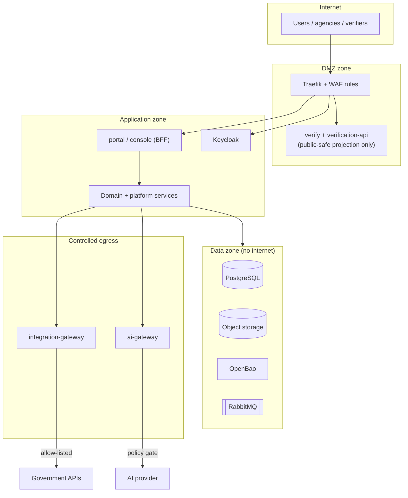

| Control | Implementation |
|---|---|
| Authentication | Keycloak: passkeys / password + OTP; MFA mandatory for staff; step-up at submission (ADR-004) |
| Sessions | BFF pattern: tokens server-side, httpOnly SameSite cookies; 5-minute access tokens, rotating refresh |
| Authorisation | CASL policies (role × tenant × scope × classification) + Postgres RLS; separation of duties; break-glass with alerts |
| Encryption in transit | TLS 1.3 at the edge; TLS between zones; mTLS for agency API clients (optional) and internal services (production) |
| Encryption at rest | Disk encryption + **field-level envelope encryption** of financial data with per-tenant keys in OpenBao; object storage SSE |
| Secrets | OpenBao; no secrets in images or repos; short-lived credentials where possible |
| Uploads | Presigned, size/type-limited; quarantine + ClamAV; content disarm for PDFs (production) |
| Egress | Only the integration-gateway and ai-gateway can reach external networks, via allow-lists |
| Audit | Reads + writes, hash-chained, signed daily anchors, object-locked archives (ADR-008) |
| Documents | PAdES signatures, QR verification, per-recipient watermarks (ADR-010) |
| Privacy | Data minimisation, no PII in URLs, logs or events; DPIA before production; Kenya Data Protection Act 2019 alignment |
| Application security | OWASP ASVS Level 2 target; dependency and container scanning in CI; secret scanning; SAST |
| Abuse | Rate limits per user, client and IP; proof-of-work challenge on public verification; brute-force protection in Keycloak |

**Top threats and mitigations:**

| Threat | Mitigation |
|---|---|
| Insider browsing declarations | Scope-limited access, audited reads, "who accessed my declaration", anomaly alerts on read volume |
| Cross-tenant data leak | RLS + CASL + tests; per-tenant encryption keys |
| Forged EACC / Commission documents | QR verification + PAdES + hash check |
| Impersonated filing | Roster match, email + phone OTP, MFA, step-up at submission (ADR-014) |
| Tampering with records or audit | Immutable JSONB snapshots, INSERT-only audit, hash chains, signed anchors in WORM storage |
| Malicious uploads / prompt injection | ClamAV, type checks, documents treated as untrusted data in AI prompts, schema-validated AI output |
| Sensitive data sent to external AI | Data-classification gate, minimisation, synthetic data in demo (ADR-007) |

---

## 9. AI architecture

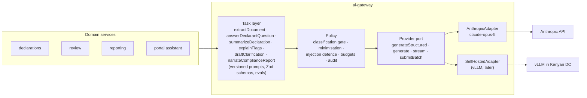

- **Deterministic code does the checking:** completeness, ±25% material change, income vs asset growth, registry cross-checks.
- **AI extracts, explains and drafts;** outputs are labelled and approved by a named officer.
- **Moving to self-hosted:** implement `SelfHostedAdapter`, run the eval sets, flip the routing table. No domain changes. (ADR-007)

---

## 10. Interoperability

- **Public API** (`/v1`, OpenAPI 3.1) for hosted and federated Commissions and employers: declarations, rosters, clarifications, Form M, directory, reference data, access requests. (ADR-009)
- **Agency APIs:**
  - law enforcement access (Reg 23)
  - compliance status verification (consent or mandate)
  - verifiable compliance certificates
  - payroll instructions (outbound)
  - ICMS referrals (outbound)
  - open data (aggregates)
- **Standards:** JSON Schemas for the First Schedule and Form M; CloudEvents + AsyncAPI; RFC 9457 errors; `Idempotency-Key`; signed receipts; signed webhooks.
- **Machine auth:** OAuth2 client credentials per organisation, scopes per API product.
- **Developer experience:** sandbox tenant, generated TypeScript/Python SDKs, conformance test suite for Admin Mechanism 39(c).

---

## 11. Scalability

| Load (December deadline) | Nominal | Stress (10x / 250k concurrent) | How we absorb it |
|---|---|---|---|
| Submissions | 7.5/s | 75/s | Stateless services, short transactions, gapless counters per issuer |
| Concurrent drafters | ~54k | 100-250k | Horizontal app scaling behind Traefik |
| Autosaves | ~900/s | 1.7-4.2k/s | Valkey, write-behind |
| Uploads | ~300Mbps | ~3Gbps | Presigned direct-to-storage |
| AI extraction | 37 docs/s peak (1.4/s avg) | - | Queue-buffered; Batch API; GPUs when self-hosted |
| Audit events | ~1.5k/s | ~7k/s | Outbox → queue → batched COPY into partitioned audit DB |
| DB reads | ~2k qps | ~5k qps | Cache + read replicas |

**Load-shaping:** reminders staggered by tenant and entity through November; per-Commission readiness dashboards; jitter on workflow timers.

**Growth paths:** Citus (shard by tenant), ClickHouse (national analytics), YugabyteDB (synchronous multi-DC), Ceph expansion.

---

## 12. Deployment

### Hackathon (Dokploy)

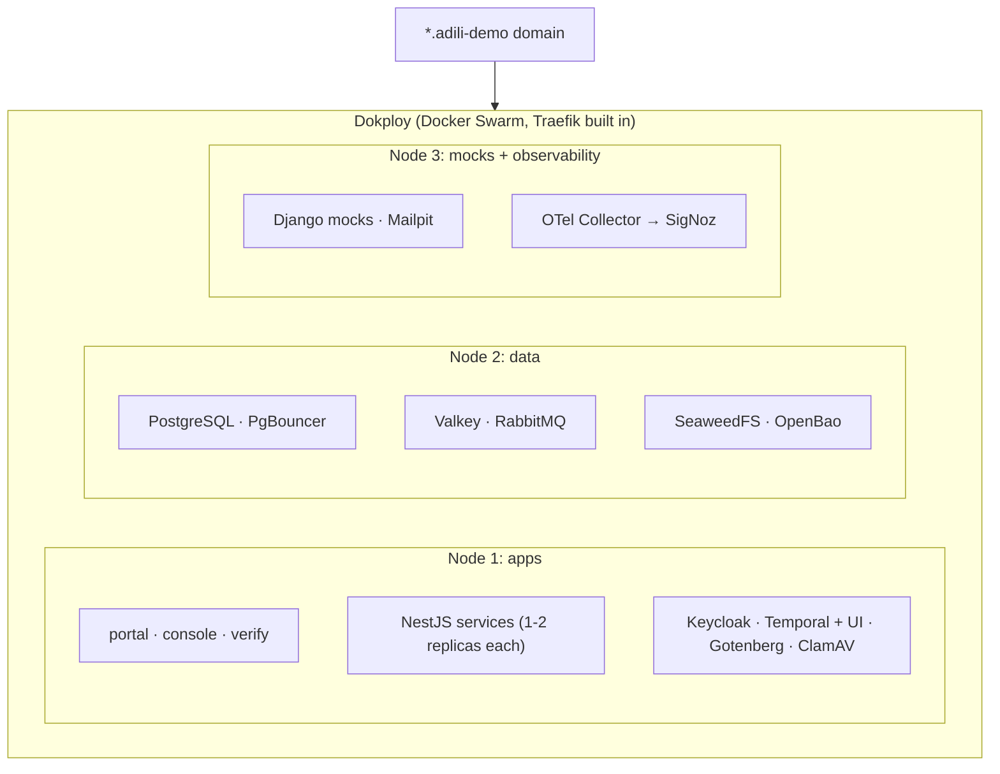

- Every component is a container image built in CI.
- Demo accounts for every role, synthetic seed data, one-command reset.
- Deploy instructions + a recorded demo backup (agenda requirement).

### Production target (EACC)

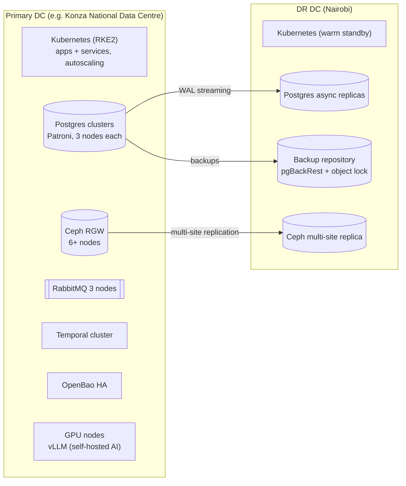

Same container images and configuration model as the demo; Dokploy (Swarm) → Kubernetes via Helm charts.

---

## 13. Backup, recovery and redundancy

*Designed, not implemented in the hackathon.*

| Component | Redundancy | Backup | Target |
|---|---|---|---|
| PostgreSQL | Patroni (3 nodes, automatic failover) per cluster; async replica in DR DC | pgBackRest full + incremental + continuous WAL to off-site object storage; point-in-time recovery | **RPO ≤ 5 min, RTO ≤ 1 h** |
| Object storage | Ceph erasure coding 4+2; multi-site replication to DR | Versioning + object lock (legal records, audit archives) | RPO ≤ 15 min |
| RabbitMQ | Quorum queues on 3 nodes | Definitions exported; messages recoverable from outboxes | No message loss (outbox) |
| Temporal | Clustered; persistence on Patroni Postgres | Via Postgres backups | Workflows resume after failover |
| Keycloak | 2-3 nodes, clustered cache | Via Postgres backups | |
| Valkey | Sentinel (3 nodes) | None needed (cache; drafts also flushed to Postgres) | |
| OpenBao | HA (Raft, 3 nodes) | Encrypted snapshots, keys escrowed under dual control | Keys are critical: tested restore |
| Audit | Its own cluster + object-locked Parquet archives + signed anchors | Archives are the backup | Tamper-evident |

**Practices:**
- 3-2-1 backups (3 copies, 2 media, 1 off-site)
- quarterly restore drills and an annual DR failover exercise
- runbooks in the repo
- backup encryption with separate keys
- monitoring of backup freshness and WAL lag

---

## 14. Observability

- **OpenTelemetry** in every service (traces, metrics, logs), sent to **SigNoz**. `traceparent` is carried through HTTP, RabbitMQ and Temporal.
- **Correlation:** request ID, reference number and tenant on every log line (no PII or financial values).
- **SLOs during the filing window:**
  - submit p95 < 1s
  - page loads p95 < 2s
  - availability 99.9%
  - acknowledgement issued < 1 min after submit
- **Business dashboards:** filings per hour per Commission, backlog of AI/integration jobs, DLQ depth, reminder delivery, Form M receipt status.
- **Alerts:** DLQ growth, outbox lag, WAL lag, audit chain verification failure, unusual read volume by a user, backup freshness.

---

## 15. Technology stack

| Layer | Choice | Licence |
|---|---|---|
| Frontend | TanStack Start (React), Tailwind, shadcn/ui, Storybook | MIT |
| Login UI | Keycloakify | MIT |
| Backend | Node.js, NestJS on Fastify, TypeScript (strict) | MIT |
| Identity | Keycloak 26 | Apache 2.0 |
| Database | PostgreSQL + PgBouncer | PostgreSQL / ISC |
| Cache | Valkey | BSD |
| Messaging | RabbitMQ | MPL 2.0 |
| Workflows | Temporal (TypeScript SDK) | MIT |
| Object storage | SeaweedFS (demo) / Ceph RGW (production) | Apache 2.0 / LGPL |
| Secrets & keys | OpenBao | MPL 2.0 |
| PDF | Gotenberg | Apache 2.0 |
| Antivirus | ClamAV | GPL (separate service) |
| AI | Anthropic API (`claude-opus-5`) behind own port; vLLM later | - / Apache 2.0 |
| Integration mocks | Python, Django, Django REST Framework | BSD |
| Edge | Traefik (via Dokploy) | MIT |
| Deployment | Docker, Dokploy (demo); Kubernetes RKE2 + Helm (production) | Apache 2.0 |
| Observability | OpenTelemetry, SigNoz | Apache 2.0 / MIT (core) |

---

## 16. Repository and engineering standards

**One polyglot monorepo** ([ADR-012](../adr/0012-single-polyglot-monorepo.md)): pnpm + Turborepo for TypeScript, uv for the Python mocks, with external-system contracts shared between both and contract-tested in CI.

```text
adili-v3/
├── apps/
│   ├── portal/              # TanStack Start: declarants, applicants
│   ├── console/             # TanStack Start: Commissions, employers, EACC
│   ├── verify/              # TanStack Start: public verification
│   └── keycloak-theme/      # Keycloakify
├── services/
│   ├── directory/  declarations/  review/  access/  reporting/
│   ├── documents/  verification-api/  ai-gateway/
│   ├── integration-gateway/  notifications/  audit/
├── packages/
│   ├── ui/                  # design system (shared by apps + Keycloak theme)
│   ├── api-kit/  data-access/  events/  temporal/  numbering/  cache/  telemetry/  bff-auth/
│   ├── schemas/             # JSON Schemas, OpenAPI, AsyncAPI (incl. external/ contracts)
│   ├── forms/               # validators, generated types and Zod schemas for the form JSON Schemas (FE + BE)
│   ├── tsconfig/  eslint-config/
├── mocks/                   # Django project (uv): iprs, kra, ntsa, brs, ardhisasa, hr, payroll, icms, sms
├── infra/                   # compose (local infra), docker (image builds), Dokploy config, seed data, runbooks
└── docs/                    # architecture, ADRs, requirements, research, legal reference, glossary
```

**Standards (judged on code quality):**
- TypeScript `strict`, ESLint + Prettier, no `any` without justification; Python: ruff, mypy, pytest.
- **Contracts first:** OpenAPI / JSON Schema / AsyncAPI in `packages/schemas`, with types generated from them.
- **Tests:**
  - unit (Vitest, `isolate: false`: test files in a worker share modules and the jsdom environment, so a test resets any module state it changes; portal and console, whose files mock the router per file, use `pool: 'vmThreads'` instead)
  - integration against real Postgres/RabbitMQ (Testcontainers)
  - RLS isolation tests
  - Temporal replay and time-skipping tests
  - Playwright end-to-end tests of the demo journeys
  - AI eval sets
- **CI (GitHub Actions):** lint, type check, tests, build, container and dependency scanning, schema diff checks. A plan job (`scripts/ci-plan.mjs`) runs only the jobs a change needs: when packaging inputs change (Dockerfile, manifests, lockfile), a production install per affected service (`scripts/check-deploy-imports.mjs`) and one service image; the Keycloak, integration and mocks jobs when their inputs change.
- Conventional commits, protected main branch, PR reviews, ADRs for significant decisions.

---

## 17. ADR index

| ADR | Decision |
|---|---|
| [001](../adr/0001-postgresql-as-sole-structured-data-store.md) | PostgreSQL as sole structured data store (Cassandra dropped) |
| [002](../adr/0002-object-storage-seaweedfs-demo-ceph-rgw-production.md) | S3 API; SeaweedFS demo, Ceph RGW production (MinIO rejected) |
| [003](../adr/0003-temporal-as-workflow-engine.md) | Temporal as workflow engine |
| [004](../adr/0004-identity-keycloak-self-registration.md) | Keycloak, Keycloakify UI (self-registration superseded by 014) |
| [005](../adr/0005-message-queue-rabbitmq.md) | RabbitMQ with transactional outbox |
| [006](../adr/0006-multi-tenancy-and-hierarchy.md) | Multi-tenancy and hierarchy (RLS, ltree, EACC not super-tenant) |
| [007](../adr/0007-vendor-agnostic-ai-layer.md) | Vendor-agnostic AI layer (Anthropic now, self-hosted later) |
| [008](../adr/0008-audit-trail.md) | Tamper-evident audit trail |
| [009](../adr/0009-api-first-interoperability.md) | API-first for Commissions, employers and agencies |
| [010](../adr/0010-verifiable-documents-qr.md) | Verifiable documents with QR codes |
| [011](../adr/0011-human-readable-reference-numbers.md) | Human-readable reference numbers + glossary |
| [012](../adr/0012-single-polyglot-monorepo.md) | One polyglot monorepo (TypeScript + Python) |
| [013](../adr/0013-service-communication.md) | Service-to-service communication (REST · events · Temporal) |
| [014](../adr/0014-roster-gated-declarant-onboarding.md) | Roster-gated declarant onboarding (EACC-provisioned Commissions, file-number match, email + phone OTP) |
| [015](../adr/0015-java-for-keycloak-providers.md) | Java (Maven) for Keycloak providers only, e.g. the `adili-otp` authenticator |

---

## 18. Open questions for EACC

1. **Scope:** do staff of PPP bodies or school Boards of Management (Act s.2 "reporting entity") file declarations, given the Art. 260 "public officer" definition?
2. **Signatures:** electronic filing is valid without a signature (First Schedule note 12). Is the **witness** on the form also waived?
3. **Initial declaration period:** is the income period the 12 months before the appointment date?
4. **Securities threshold:** does the 10% threshold (Reg 17) apply to DIALs, or must every holding be declared?
5. **Transfers:** may a new responsible Commission see declarations filed with the previous one, or only the computed material changes?
6. **Compliance status sharing:** may filing status be shared with vetting bodies (IEBC, Parliament) without the officer's consent, given s.46?
7. **Interfaces:** specifications for ICMS, payroll (IPPD/HRMIS) and HR systems, or should we keep mocking them?
8. **Administrative Mechanisms (Gazette, Aug 2026):** can we get the official text? Our details come from press coverage.
9. **AI and data residency:** EACC's position on external AI processing of synthetic vs real data, and the DPO's view on a self-hosted model.
