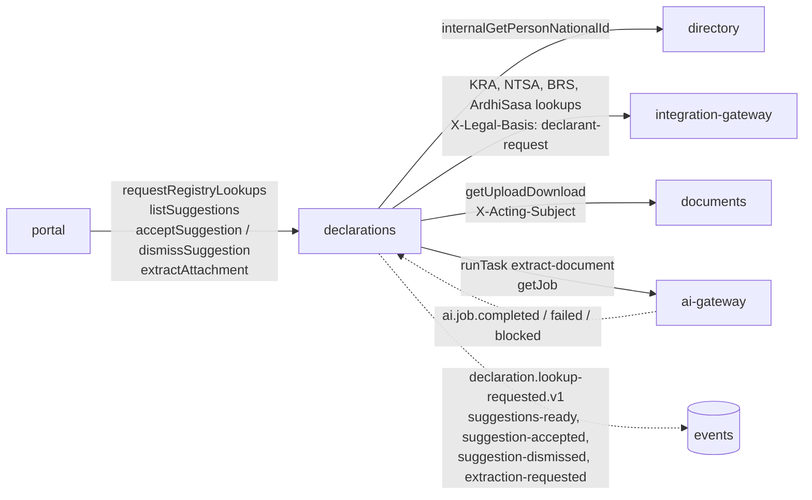

# Spec 05b contract convergence: registry suggestions and document extraction

How the contracts drafted for spec 05b (#295, contract commit `bde37c16`) compare with what was built, after #469 (backend: #306, #307, #310, #311, #318), #401 (portal), #506 (#314) and #520 (#315).
Each difference below was decided in the ticket named; the generated contract in `packages/schemas/internal/<service>.yaml` is now the source of truth.
ADR-013 §8.12 and §8.13 record the registry lookups' calls and why accept and dismiss take no `Idempotency-Key`; ADR-007's gate amendment (#314) records the demo tenant's `extract-document` rule.

## State

| Contract | Source | Drafts left | Drift check |
|---|---|---|---|
| `internal/declarations.yaml` | exported from `services/declarations` (`pnpm --filter @adili/declarations contracts`) | `drafts/declarations.yaml`: spec 11's `getSuggestedQuestions` (#544), once #513 and #536 merge. #469 removed the suggestion operations, #520 `extractAttachment` | `pnpm contracts:drift` |
| `internal/ai-gateway.yaml` | exported | none (`drafts/ai-gateway.yaml` deleted by #314: `extract-document`'s input and output come from its Zod schemas) | same |
| `internal/integration-gateway.yaml` | exported | none | same |
| `internal/directory.yaml` | exported | none | same |
| `forms/declaration.v1.json` | hand-written | n/a | `pnpm --filter @adili/schemas lint:forms` meta-validates and compiles it; the `@adili/forms` tests check its fixtures, the `ItemSource` ones in `forms/fixtures/declaration.v1` (`valid/biennial-prefilled.json` with KRA, ArdhiSasa, NTSA and document sources, `invalid/p8-statement-item-source-unknown-kind.json`), and `declaration-sections.test.ts` checks `ITEM_SOURCE_KINDS` against the schema's enum |

No spec 05b operation is left in any draft. Every operation `bde37c16` drafted is built under the operation id and path it drafted: 5 in declarations, 1 task in the ai-gateway.
CI runs `pnpm contracts:drift` in the TypeScript job: a service whose export differs from its committed file, or a client (`*.gen.ts`) generated from a stale contract, fails it.

## Declarations (`internal/declarations.yaml`)

Operations changed:

- `requestRegistryLookups` (#310): the body is the named `RegistryLookupRequest`; `consent.textVersion` must not be empty. `Idempotency-Key` is required. Problems: 400 `consent-required` (the declarant did not tick the request), 400 `no-id` for a spouse or child with no national ID in Household, 409 `declaration-not-draft`, 422 for a reused key. The declarant is looked up by the national ID on their person record (the directory's new `internalGetPersonNationalId`); a declarant without one gets a `no-id` set rather than a 400, as the draft's set status allowed.
- `listSuggestions` (#310): `sectionKey` is a pattern string (the draft referenced `SectionKey`, which the export inlines for queries). A set with suggestions, none in the section, is left out; one with none yet is kept so a pending lookup can be polled. 400 on a bad query. An audited read.
- `acceptSuggestion` (#311, #315):
  - The body is the named `AcceptSuggestionRequest`, the answer `SuggestionAcceptance`, with the new draft version also in the `ETag` header.
  - A stale `If-Match` is 409 `draft-version-mismatch` (the draft had 412), while section saves keep 412. A missing one is 428 `if-match-required`. 409 also for `not-new` (the draft's "not `new`"), `declaration-not-draft` and `section-archived`.
  - No `Idempotency-Key` (ADR-013 §8.13): the replay store keeps no `ETag`, and accept is safe to retry under the suggestion's row lock.
  - Registry suggestions never set a value field; a document's reading does write its amounts, at their declaration.v1 paths within the item, since the declarant reviews each one (#315). `AcceptSuggestionRequest.fields` says so: a document's fields come by path, values included, typed as read (an amount may come as text, such as "1,180,000"), and a field it did not read is refused. The 400 lists "a field it did not read, or a value the field cannot take".
  - Where each type lands is documented: `vehicle`, `land`, `shareholding` an asset of the person's statement; `income-hint` a salary income with no amount; `directorship` a registrable interest in `other`; a spouse's `bio-tax` their KRA PIN in `household`. The declarant's own `bio-tax` has no field yet: 400 (#474).
  - `ItemSource.verificationResultId` is named only when the item ends up holding what the registry gave.
- `acceptSuggestion` and `dismissSuggestion` are audited reads of the suggestion (`declaration.suggestion.read`).
- `dismissSuggestion` (#311): body named `DismissSuggestionRequest`. Dismissing again answers the suggestion as it is (first reason kept, no second event). 409 `not-new` covers accepted and superseded; 400 for a reason over 200 characters.
- `extractAttachment` (#315):
  - `targetItemType` is gone from the body. The target is the item the document is attached to: its statement list and type, sent to the gateway as `target: {section, itemType}` (see the ai-gateway below). The body is the named `ExtractAttachmentRequest`, `{documentKindHint, language}`, required, as drafted (`language` defaults to `en`).
  - `Idempotency-Key` is required.
  - Not enabled is a `not-enabled` set (202), not the draft's 409 `not-enabled`: the gateway decides by policy when the job is created and records a `blocked` job in its audit, so there is no pre-check.
  - Problems: 400 for no body, a missing or unknown kind, an unknown language, an attached item with no type, or a missing Idempotency-Key; 404 when the declaration or attachment is not found or not visible to the caller (another declarant, a reviewer, an attachment not on the draft). 409 `declaration-not-draft`, `upload-not-clean`, or a request with the same Idempotency-Key still running; 422 for a reused key; 503 `documents-unavailable`, `ai-gateway-unavailable` or `workflow-unavailable` (Documents, the gateway or the workflow engine could not take it now). On those 503s the reading is recorded `failed` with no job: `document-unavailable` when Documents did not answer, `unavailable` otherwise; asking again reads anew. A request refused for the file itself or the draft (404 gone, 409 not clean or past the draft) records nothing.
  - Concurrent requests: the first reserves the pending set and only it downloads and asks the gateway; the others are answered with that set. When the reserving request fails with a 503, they see the set end `failed`. When it is refused (404, 409), the reservation is taken back: a concurrent request that finds it gone at once gets 503 `reading-conflict` (asking again gets the refusal), and one already polling no longer finds it listed. A concurrent request also gets 503 `reading-conflict` in a narrow race: its reservation clashes with the first one's, which has already left `pending` by the time it looks (failed on a 503, or ended at once as `not-enabled`, from the gateway's cache, or as an unreadable type). `reading-conflict` is retryable: asking again answers or reads anew. The portal treats a set that disappears from `listSuggestions` as ended ("the file is not ready to be read") and offers Try again.
  - One reading is pending per attachment, kind, section and item type (declarations migrations 0022 and 0023). Asking again for the same attachment, kind, section and item type while a reading is pending, or offered and not decided on, answers that reading. A reading that becomes `ready` supersedes the `new` suggestions of the attachment's earlier ones.
  - A file a reading does not take (HEIC) fails at once as `document-unreadable`, without being sent (#505).
  - A `DocumentReadingWorkflow` on the declarations worker settles the set. For a live job, it is started inside the transaction that records the job (`DocumentReadingInput.transactionId`). It carries the requesting declarant's person id and subject from their token, so no tenant-wide read finds whose draft it is. A reading not settled within 15 minutes fails as `unavailable`, and the declarant can ask again. A reading that settles after the declaration was submitted writes nothing into it and fails its pending sets as `not-a-draft` (ADR-018 decision 5).
  - An audited read.

Schemas changed:

- `SuggestionSet`: `attachmentId`, `documentKind` and `reason` added (#315), null for registry sets. `reason` says why a document set `failed`, in the declarant's vocabulary: `document-unavailable`, `document-unreadable`, `not-read`, `unavailable` (the gateway's `budget`, `provider`, `timeout` and the like all read as `unavailable`), `not-a-draft` (a reading that settles after the declaration was submitted). Statuses are as drafted, each documented.
- `Suggestion`:
  - `itemType` is still a free string, as drafted; only its description changed. It now names `directorship` (BRS: a paragraph 9 registrable interest, in `other`) and `income-hint` (KRA: a hint to check the salary item, never a value), and BRS shareholdings as `shareholding`, not the spec's `investment`, which `declaration.v1` does not have (#306).
  - `fields` are documented per item type (`vehicle` registration, make, model, year; `land` parcelNumber, size, location, county; and so on). A document's reading names them by declaration.v1 path within the item (`details.registration`, `outstanding.kesCents`) instead (#315).
  - `sourceRef` is documented: a registry's identifiers and facts that do not become fields; for a document `documentKind`, `fields: [{name, confidence, page}]`, `warnings` and `attachmentId`.
  - `confidence` is a document reading's least sure field's; `matchItemId` is, for a document, the item it is attached to.
- New: `RegistryLookupRequest`, `AcceptSuggestionRequest`, `SuggestionAcceptance`, `DismissSuggestionRequest`, `ExtractAttachmentRequest`.
- Bio sections (#318): `SectionEnvelope.prefilledFields` and `SectionSaveResult.prefilledFields`, the JSON pointers of the bio fields pre-filled from the roster that still hold its value. A save that changes one drops it.
- Problem codes `consent-required`, `no-id` and `not-new` join the shared list (every exported contract carries it).
- Nullables are `anyOf [..., null]` rather than `type: [..., 'null']` (code-first export).

## declaration.v1 (`forms/declaration.v1.json`)

- `ItemSource` is built as drafted (#307): `kind`, `suggestionId`, `at` required, `verificationResultId` and `aiJobId` optional, on asset, income and liability items. The sealed snapshot and the internal version document keep it as saved; suggestions themselves never reach the submitted version.
- Directorships in `other` gain an optional `id` and `source` (#311), so one added from a BRS suggestion can be matched and badged. The documents service's payload schema that mirrors `other` gained them too.

## ai-gateway (`internal/ai-gateway.yaml`)

- `extract-document` (#314) is a registered task under `runTask`, not a draft. Its input and output come from the task's Zod schemas:
  - `ExtractDocumentInput.targetItemType` (a string) became `target: {section, itemType}`, a union per statement list with its item types, because `other` is an item type of all three.
  - `attachment.contentType` is an enum (`application/pdf`, `image/jpeg`, `image/png`, `image/webp`), `sha256` a hex pattern. The link is never sent to the provider, and the cache and Idempotency-Key ignore it, so a fresh link to the same file is the same request.
  - `ExtractDocumentOutput.detectedKind` is the kind enum; `fields` at most 30, each `value` a string, number or boolean (no dates: declaration.v1 has none in these items), `page` 1 or more or null; `warnings` at most 10 sentences in the request's language.
  - The data class is `highly-confidential` only.
  - Not in the contract: a text layer is minimised by shape and by label before it reaches a provider. Labelled member and payroll numbers are their own token kind (`MEMBER_NUMBER`), and organisations named after a party label are tokenised as `ORGANISATION`. Names printed with no label are #504.
- `JobReason` gains `document-unavailable` (the link expired or the store did not answer: ask again with a fresh link) and `document-unreadable` (wrong SHA-256 or type, damaged, too many pages or bytes).
- `GateRuleInput.tasks` and `GateRule.tasks` (#314): a gate rule may name the tasks it is for; any other task follows the default for the pair. `tasks: null` widens a scoped rule to every task; a change that leaves `tasks` out over a scoped rule is refused. The demo tenant's rule names `extract-document` (ADR-007 amendment). `TenantAiStatus` ignores a rule that does not cover every reviewer task, so it says nothing about document reading (#515).
- Story 18 (a commission-admin sees whether document reading is enabled, "via 07c status") is not in the contract: #515.

## Integration-gateway (`internal/integration-gateway.yaml`)

- No new endpoints, as drafted. `X-Legal-Basis` on the KRA, NTSA, BRS and ArdhiSasa lookups, and on review's `checkCompanySuppliesEmployer` (07b, which shares the lookup headers), is an enum (the draft described it as free text) of `regs-r20-1-b`, `act-s35-5` and `declarant-request` (#469).
- Each basis is taken only from the client whose work it is: `declarant-request` from declarations, the other two from review; 403 otherwise (ADR-013 §8.12). `adr-014-onboarding` is no longer accepted in the header (400): the IPRS route records it itself.
- `X-Case-Ref` and `X-Subject-Person` are documented for both callers on the same routes, `checkCompanySuppliesEmployer` included: the review case and its declarant, or the declaration and the declarant who asked, even when the person looked up is a spouse or child (#321).
- NTSA's vehicle result has no engine capacity, so the `vehicle` suggestion has none (#475).

## Directory (`internal/directory.yaml`)

- Added `internalGetPersonNationalId` (#469, scope `directory:person-national-id`, declarations only, audited): the national ID verified at onboarding, for the declarant's own lookups.
- Roster records gain `workStation` and `maritalStatus` (#318) in the upload template, the HR push, the rejected-rows report and the internal read. Marital status takes only declaration.v1's five values.

## Events

Built as the spec lists them, identifiers only, in `services/declarations/src/suggestions/events.ts` (service-local, as review's are), with more identifiers than drafted:

| Event | Drafted | Built adds |
|---|---|---|
| `declaration.lookup-requested.v1` | declaration, tenant, person key, systems | `consentId`, `consentedBy`, `consentTextVersion`: it is the lasting audit record of the consent, since the draft's copy expires with the draft |
| `declaration.suggestions-ready.v1` | declaration, set, source, count | none; also sent when a document reading is ready (#315) |
| `declaration.suggestion-accepted.v1` | ids | `setId`, `source`, `sectionKey`, `itemId`, `applied` |
| `declaration.suggestion-dismissed.v1` | ids | `setId`, `source` (the reason stays with the suggestion) |
| `declaration.extraction-requested.v1` | declaration, attachment, job | `setId`; `aiJobId` null when the file was not one a reading takes |

Declarations consumes the ai-gateway's `ai.job.completed|failed|blocked.v1` for `extract-document` jobs whose subject is a declaration (#315). The consumer only signals the reading's `DocumentReadingWorkflow`, which pulls the job and settles the set.

## Open after convergence

None of these is a contract left in a draft; each needs a contract change when it is built:

- #474: a declaration.v1 field for the declarant's own KRA PIN and compliance status (story 7). Until then accepting the declarant's `bio-tax` suggestion is 400.
- #475: NTSA engine capacity in the gateway's vehicle result.
- #504: the declarant's and household's names in `ExtractDocumentInput`, so minimisation tokenises them anywhere in a text layer.
- #505: HEIC and oversized images in `extract-document`.
- #515: document reading in the Commission's AI status for commission-admins (story 18).

**Not a contract change:**

- #530: registry lookups start their workflow after commit, and settle on a declaration past the draft.
