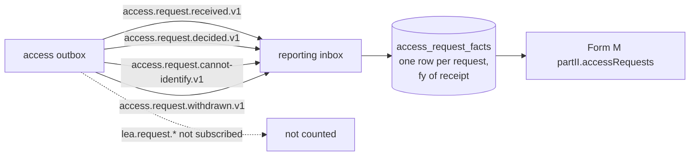

# Spec 10 contract convergence: access requests

How the contracts drafted for spec 10 (#239, contract PR #240) compare with what was built, after #271.
Each difference below was decided in the ticket named; the generated contract in `packages/schemas/internal/<service>.yaml` is now the source of truth.

## State

| Contract | Source | Drafts left | Drift check |
|---|---|---|---|
| `internal/access.yaml` | exported from `services/access` (`pnpm --filter @adili/access contracts`) | none (`drafts/access.yaml` deleted: every operation is built) | `pnpm contracts:drift` |
| `internal/declarations.yaml` | exported | `drafts/declarations.yaml`: specs 05b and 11 only (suggestions, extraction, assistant, hints, help themes, help search as declarants see it and corpus passage text for the console, #550) | same |
| `internal/directory.yaml` | exported | none (`drafts/directory.yaml` deleted by #246 and #263) | same |
| `internal/documents.yaml` | exported | none (`drafts/documents.yaml` deleted: #194 built spec 08's `internalGetDocument`, #470 spec 07a's `revokeDocument`) | same |
| `internal/notifications.yaml` | exported | none | same |
| `forms/form-k.v1.json` | hand-written | n/a | `pnpm --filter @adili/schemas lint:forms` (meta-validation and compile), fixtures in `forms/fixtures/form-k.v1` checked by `@adili/forms` tests (`form-k.test.ts`) |

No spec 10 operation is left in any draft.
`pnpm contracts:drift` finds every service with a `contracts` script, so access joined the check when #244 added its script; CI runs it in the TypeScript job, together with the `*.gen.ts` diff.

## Access (`internal/access.yaml`)

Operations dropped:

- `downloadAccessPackage`, `downloadLeaPackage` and the `DownloadLink` schema (#258, #259, #264). Documents hands a download link only to the subject person, who calls documents' `getDocumentDownload` with their own token and `package.documentId`. No service fetches a link for someone else.

Operations added (not in the draft):

- `listRosterCandidates` (#253) and `listLeaRosterCandidates` (#265): the officer searches the Commission's roster through access, which proxies the directory's new `search` mode.
- `getRepresentationAttachmentDownload` (#254): the officer opens a declarant's representation attachment, as an audited read.
- `getMyCertifiedCopy` (#267): the portal polls one copy until it is issued.
- Self-access applications (#303, #304): `searchSelfAccessDeclarants`, `listSelfAccessDeclarantVersions`, `recordSelfAccessApplication`, `listSelfAccessApplications`, `getSelfAccessApplication`, `markSelfAccessDelivered`.
- `recordDecisionWrittenNotice` (decision 2, review round 1): the access officer records the day the decision was served in writing on a declarant with no account (`OfficerRequestView.decisionNotice`, register kind `decision-notified`, `access.request.decision-notified.v1`).
- Scope preview (decision 1): `getAccessRequestScopePreview` / `previewAccessRequestScope` and `getLeaRequestScopePreview` / `previewLeaRequestScope` return `ScopePreview`, audited counts of what the requested (GET) or a narrower (POST) scope holds, never content. Access officer and supervisor, once the officer named is identified (Form K) or the request verified (law enforcement), until the decision.

Operations changed:

- `submitAccessRequest`: the body is the named `FormK` schema (form-k.v1 without `meta`). Applicant identity comes from the token's `person_id` and the directory (#244, #250). Problems 422 and 503 added.
- `resolveRequestedOfficer`: `note` dropped, nowhere to keep or show it (#253). Accepts `Idempotency-Key`.
- `verifyApplicantIdentity`, `withdrawAccessRequest`, `submitRepresentations`, `verifyLeaRequest`: accept `Idempotency-Key` (ADR-013 §7.5). `decideAccessRequest`, `decideLeaRequest`, `submitLeaRequest`, `recordSelfAccessApplication` require it.
- `verifyLeaRequest`: body gains `provenanceConfirmed: true` and `reasonConfirmed: true` (#264). The officer confirms the two checks the prototype shows.
- `requestCertifiedCopy`: body gains `commission` (slug). A declarant token's `tenant` claim names only one Commission, and declarations needs the acting tenant (#267).
- `getMyAccessHistory`: returns `AccessHistoryEntry` (a `RegisterEntry` plus subject, reference, Commission, requester, case reference, outcome, certified copy) instead of bare `RegisterEntry` (#267); Form K entries also carry `purposeInGeneralTerms` and `scope` (requested, then granted).
- `listCommissionAccessRequests`: query gains `late` and `search`. Open requests come first by earliest deadline, then decided and closed ones by latest deadline. Response is the named `QueuePage` (#253, #254).
- `listAccessCommissions`: named `AccessCommission`. `years` run from `max(2025, obligations start)` to the current year (#commissions). Law enforcement may call it too (#265); `decisionDays` is the Commission's Form K decision period in force (decision 3).
- Every operation documents its 400/403/404/409/503 problems; the draft listed few.

Schemas changed:

- `CertifiedCopy`: `downloadUrl` dropped (documents serves the download), `commission`, `reference`, `issuedAt` added (#267).
- `DeclarantNotice`: `status` and `canRespond` added (#253); `agency` and `caseReference` added for law enforcement notices (#264).
- `OfficerRequestView`: a flat object instead of `allOf(AccessRequest, ...)`, plus `resolvedName` and `resolvedFileNumber` (#250, #254).
- `QueueItem`: `resolvedFileNumber`, `closedAt` added; `status` is the union of Form K and law enforcement statuses (#254, #264).
- `LeaRequest`: `provenance`, `breachedAt` (the day-14 breach flag), `resolvedRosterRecordId`, `resolvedName`, `declarantNotifiedAt` added, and `verification` is now `LeaVerification` (#264).
- `Package`: `kind` added, `access-package` or `nil-letter` (decision 1). `AccessRequest`, `OfficerRequestView` and `LeaRequest` gained `packageFailedAt`, set when issuing failed after its retries, so a failure reads apart from a package being prepared.
- `Scope.years` and `Scope.sections` lost `uniqueItems` (Zod cannot express it); form-k.v1 still enforces uniqueness on submit (#244).
- Nullables are exported as `anyOf [..., null]` rather than `type: [..., 'null']` (code-first export).

## Declarations (`internal/declarations.yaml`)

- `internalRenderDisclosure`: `tenant` moved from the body to `X-Acting-Tenant` (an unknown body key is 400). The response is the named `DisclosureDocument`, with `DisclosedVersion`, `DisclosureSection`, `GrantReference` and `LegalBasis` (#257).
- `internalGetFullDocumentForCertifiedCopy`: `X-Acting-Tenant` and query `personId` required (404 unless it is that declarant's version). Returns the new `FullVersionDocument` instead of review's `InternalVersionDocument` (#257).
- Added `internalListPersonVersions` (#303), so the officer's self-access form only offers the declarant's own submitted versions.
- Added `internalCountDisclosure` (decision 1, scope `declarations:disclosures`): per year of a scope, the person's versions in force and per section and household member kind how much the disclosure would let out; counts only, zero rather than 404, audited as `declaration.disclosure-counted` with the officer as recipient.

## Review (`internal/review.yaml`)

- Added `internalDiscloseClarifications` (decision 7) and `internalCountClarificationDisclosure` (decision 1, scope `review:disclosures`): per declaration named, how many clarifications a grant of the scope would disclose, audited as `clarification.disclosure-counted`.

## Directory (`internal/directory.yaml`)

- `startApplicantOnboarding`: `email` is required (it is the account's username, and the set-password link proves it). Returns `ApplicantOnboardingSessionCreated` (#246), which gained `fullName` and `identityDocument.number/country` (#247).
- Added the rest of the applicant flow: `getApplicantOnboardingSession`, `verifyApplicantOnboardingOtp`, `resendApplicantOnboardingOtp`, `completeApplicantOnboarding`, `resendApplicantSetPasswordEmail`, `getMyApplicantProfile`. Also the internal `internalGetApplicant` and `internalVerifyApplicantIdentity` (scope `directory:applicants`) (#246).
- Added `internalGetLeaOfficer` (#264): access checks an officer's provenance against the directory, not token claims.
- `internalListRosterRecords`: third mode `search` (#253).
- `InternalCommissionListItem`: `status` and `obligationsStartDate` added (#commissions).
- `LeaOfficerAccount`: `phone` added. `provisionAgencyOfficer` body is the named `ProvisionAgencyOfficer`. Provisioning converges per email, with 409 `lea-officer-of-other-agency` / `email-belongs-to-other-tenant` (#263).

## Documents (`internal/documents.yaml`)

- `DocumentType` gained `access-package` and `certified-copy`, with `AccessPackagePayload` and `CertifiedCopyPayload` (#258), and `access-nil-letter` with `AccessNilLetterPayload` (decision 1): the signed letter a grant whose scope holds nothing delivers instead of the package, with the package's watermark, download window and subject person rules.
- `IssueDocument` gained `watermark`, `downloadWindowDays` (#258) and `additionalDownloaders` (#304, for the officer who hands over a certified copy in person). `IssuedDocument` gained `downloadExpiresAt`.
- `getDocumentDownload`: 410 `download-window-closed` once the window has passed (#258).
- `UploadPurpose` gained `access-representation` (#258), open to the declarant and the access officer (#303).

## Notifications (`internal/notifications.yaml`)

- `TemplateId` gained the access templates (email and SMS each). Spec 10 drafted `access-request-notified`, `access-decision-applicant`, `access-decision-declarant`, `access-package-ready`, `access-officer-reminder`, `lea-grant-notice`, `lea-decision`, `certified-copy-ready` (#258). `access-acknowledgement` was added for the receipt (#250). `access-nil-letter-ready` (same params as `access-package-ready`) announces a nil letter instead of a package: the Commission holds no declaration within the granted scope, so it carries no warning about sharing what it discloses.

## Reporting: access events for Form M section 5

Access publishes one event per access-register entry (`packages/events/src/contracts/access.ts`), with Zod schemas in `@adili/events/contracts/schemas` (#267). Integration tests parse the published events with these schemas: Form K in `services/access/test/requests/form-m-events.integration.test.ts`, law enforcement receipt and decision in `test/lea/lea-requests.integration.test.ts`.

| Form M section 5 | Event | Schema |
|---|---|---|
| `received` | `access.request.received.v1` (also sent for requests held for passport verification) | `accessRequestReceivedDataSchema` |
| `granted` | `access.request.decided.v1`, `outcome` `grant` or `partial-grant` | `accessRequestDecidedDataSchema` |
| `declined`, `declineReasons` (Regulation 24 grounds) | `access.request.decided.v1`, `outcome` `deny`, `grounds` | `accessRequestDecidedDataSchema` |
| `declined`, reason `other` | `access.request.cannot-identify.v1`, `declineReason: 'other'`: its own event type, not a `decided` event | `accessRequestCannotIdentifyDataSchema` |
| (received only) | `access.request.withdrawn.v1` | `accessRegisterEventDataSchema` |

Reporting projects these into `access_request_facts` (#467): one row per Form K request, keyed by the request id, with the Commission, the financial year it was received in, its outcome, the grounds cited and whether it was withdrawn. No personal data. Form M section 5 compiles from it with the rules decided on #239:

1. **Form K only.** Section 5 counts applications by "a person" for purposes of s.36; law enforcement requests (`lea.request.*`) are not subscribed to.
2. **(a) received:** every Form K request received in the financial year.
3. **(b) granted:** `grant` and `partial-grant`.
4. **(c) declined:** `deny` plus `cannot-identify` closures.
5. **(d) reasons:** a count per Regulation 24 ground cited on denials and partial grants, plus `other` per cannot-identify closure, in Regulation 24 order, reasons none cited left out. A denial citing several grounds counts once under each, so the reasons may add up to more than (c); `federated-submission.ts` accepts reasons that add up to at least (c).
6. **Year of receipt.** Outcomes count in the financial year the request was received, so (b) + (c) never exceeds (a). A withdrawn request counts in (a) only. Each event applies once, in any order, and the earliest receipt, closure and withdrawal of a request hold, so a re-emitted or conflicting one cannot move its year or outcome.
7. **`dataUnavailable`** is false for every hosted report. Gap 6 of the original analysis wanted it true for years before access went live; access ships with the platform, whose first reportable year (`FIRST_FINANCIAL_YEAR`, 2025) is also the first year Form K requests are taken, so no hosted year precedes it. A deployment that turns access on later would need a go-live year here.

#238 (reporting contract convergence, spec 09) does not conflict with any of this. It exports reporting's HTTP contract and checks form-m.v1 in CI; reporting has no HTTP dependency on access, and #238 does not cover consuming access events. The two only touch the same lists of exported services (CI comment, `docs/how-we-work.md`, `docs/agents/issue-tracker.md`), so whichever merges second adds its service to those lists.
