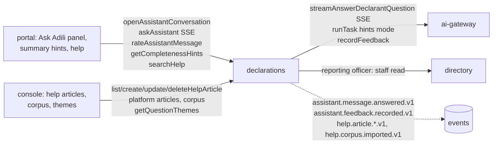

# Spec 11 contract convergence: AI filing helper

How the contract drafted in `bde37c16` for spec 11 (#296) compares with what was built, after #417 (#324), #445 (#325), #473 (#332), #513 (#333), #526 (#335) and #536 (#339).
Each difference below was decided in the ticket named; the generated contract in `packages/schemas/internal/<service>.yaml` is now the source of truth.
ADR-019 records the streamed answer's tagged text; ADR-013 §2 and §8.14 the answer stream's timeouts and acting tenant; ADR-018 decision 8 the conversations' person-scoped writes.

## State

| Contract | Source | Drafts left | Drift check |
|---|---|---|---|
| `internal/declarations.yaml` | exported from `services/declarations` (`pnpm --filter @adili/declarations contracts`) | `drafts/declarations.yaml`: spec 11's `getSuggestedQuestions` (#544) and the console's `previewHelpSearch` and `getCorpusPassage` (#550), and spec 05b's `extractAttachment` until #520 merges | `pnpm contracts:drift` |
| `internal/ai-gateway.yaml` | exported from `services/ai-gateway` (`pnpm --filter @adili/ai-gateway contracts`) | `drafts/ai-gateway.yaml`: spec 05b's `extract-document` only, until #506 merges; no spec 11 component | same |
| `internal/directory.yaml` | exported | none (spec 11 added nothing) | same |

Of the 10 declarations operations `bde37c16` drafted for spec 11, 9 are built under the operation id and path it drafted; 7 more were added (help administration). `getSuggestedQuestions` is the one left in the draft: the portal curates the suggested questions itself (#335), and the "top themes" half needs a decision first (#544).
The ai-gateway's `streamAnswerDeclarantQuestion` and the `answer-declarant-question` task are built under the drafted path and name; the task's input and output come from its Zod schemas.
CI runs `pnpm contracts:drift` in the TypeScript job: a service whose export differs from its committed file, or a client (`*.gen.ts`) generated from a stale contract, fails it. The declarations integration tests also validate the answers against the committed file (`test/support/contract.ts`), the assistant's SSE `final` frame against `AssistantAnswer` included (#348).

## Declarations: help (`internal/declarations.yaml`)

Operations added (not in the draft), #325:

- Platform articles, platform-admin only (403 otherwise): `listPlatformHelpArticles`, `createPlatformHelpArticle`, `updatePlatformHelpArticle`, `deletePlatformHelpArticle` under `/v1/help/articles`. The spec's authorisation table had platform articles; the draft had no operation for them.
- `deleteHelpArticle` for a Commission article (commission-admin).
- The corpus, platform-admin only: `listCorpusPassages` (`GET /v1/help/corpus`, every wording with its period and version, read-only) and `importCorpus` (`POST /v1/help/corpus/import`, re-imports the corpus files deployed with the service; the same files are a no-op, `skipped`).

Operations changed:

- `searchHelp` (#325, #333):
  - Declarants only (by the `person_id` claim); anyone else 404. The draft said "signed-in users".
  - Gains `itemType` (a statement item type, boosted like the section) and `date` (the law in force on that day; today by default). `sectionKey` is a pattern string.
  - Covers the platform's published articles and those of every Commission the declarant has filing obligations with. Ask Adili's retrieval reads only the platform's and the conversation's Commission's.
  - A Swahili question also searches Swahili article bodies and is expanded into the English of the law through a glossary (`src/help/glossary.ts`): there is no official Swahili text of the Act or Regulations.
  - 400 and 404 documented.
- `listHelpArticles`: the Commission's administrators and reporting officers; anyone else 404. Last updated first.
- `createHelpArticle`: `Idempotency-Key` required (ADR-009). Reporting officers 403, anyone else 404. 400, 409 and 422 for the key.
- `updateHelpArticle`: also unpublishes. 400 documented.

Schemas changed:

- `HelpArticle` is a flat object instead of `allOf(HelpArticleInput, ...)`. `tenant` is the Commission's slug, null for the platform; `version` counts saves.
- `HelpArticleInput`: `tags` are `HelpTag` (section kinds, statement item types and corpus topics), at most 20, instead of free strings; `title` and `bodyEn` have `minLength: 1`; `effectiveTo` is exclusive.
- `HelpPassage`: as drafted; `language` is the named `HelpLanguage`, the language of the snippet.
- New: `HelpLanguage`, `HelpTag`, `CorpusPassage`, `CorpusImportResult`.
- Help articles have their own table, not rows of `corpus_passages` as the BE detail sketched: they have a tenant, row-level security, a publish flag and an author (#325).

## Declarations: Ask Adili (`internal/declarations.yaml`)

Operations changed:

- `openAssistantConversation` (#333): the inline body is now the named `OpenAssistantConversationRequest`, with the drafted fields. Opening in another language switches the conversation. A conversation outside a draft is opened at the Commission of the declarant's latest filing obligation and keeps it until it expires 30 days after its last message; a newer obligation elsewhere does not move it (note on #296). 404 also for a declarant with no filing obligation; 400 documented.
- `askAssistant` (#333):
  - The inline body is now the named `AskAssistantRequest`, with an optional `itemType` (as in help search) added. `sectionKey` is ignored outside a draft.
  - SSE events: `delta` {text}, then `final` {question, answer} (`AssistantAnswer`, both turns as stored), or `error` {code: `assistant-unavailable`}; a `: ping` every 15 s. The draft named the events, not the final frame's shape.
  - **Both turns are stored together when the answer ends.** The spec's flow stored the question first. A gateway failure, a job error or a declarant who leaves stores nothing, so those questions reach neither the history nor the theme counts (notes on #296 and #339).
  - **Only citations decide a decline.** An answer is kept when every block cites passages retrieved for it; otherwise, or when the gateway declines, the stored answer is the decline with the reporting officer's contact. A section link that names no live section of the draft, or whose field path is not a pointer of field names and indexes, is **dropped** (`sectionLink: null`) rather than declining the answer, as the BE detail had it (note on #296).
  - **No AI call when retrieval finds nothing** (after retrying a follow-up with the previous question): the decline, with `label: null` and no job.
  - 429 `rate-limit-exceeded` with the RateLimit headers (per declarant, `assistant=20/60s`); 503 problem type `assistant-unavailable` before the stream opens, nothing stored; 400 documented.
- `rateAssistantMessage` (#339):
  - The inline body is now the named `RateAssistantMessageRequest`, with the drafted fields.
  - Answers the rated `AssistantMessage` (the draft had no body).
  - Rating and reason are forwarded to the answer's gateway job (`recordFeedback`) first, then kept on the message; reason and note encrypted. The note is never sent on. A second rating replaces the first.
  - A decline made without the AI has no job and is kept only. A job the gateway does not know is kept with `forwarded: false` in the event.
  - 503 `assistant-unavailable` when the gateway cannot take it: nothing kept. 404 for a question, another person's message or a conversation gone with its draft; 400 documented.
- `getCompletenessHints` (#339):
  - Answers the named `CompletenessHints` `{status, label, residuals[]}` instead of an array of `{ruleId, fieldPath, text, hint}`.
  - `residuals` are the summary's `blocking` (`CompletenessHint`: its `sectionKey`, `path`, `code` and `message`, the deterministic text), each with `hint`, so the portal joins them to the summary.
  - `status`: `ready`, `pending` (the job is still running after the 10 s wait; ask again) or `unavailable` (no AI now: text only). `label` is the hints' AI label.
  - Only the first 20 residuals that are rule ids and field paths get a hint (the gateway's `residuals.maxItems`).
  - Cached by (residual set hash, language, prompt version) and shared across declarants and Commissions: the key and the hints hold no Commission's data and nothing personal (migration 0025).
  - 400 documented.

Schemas changed:

- `AssistantMessage`:
  - `reportingOfficer` added (`ReportingOfficerContact`: name, email, phone), on a declined answer; null when the Commission has none on record (#333). `phone` is always null until #510.
  - `label` is the typed `AssistantAiLabel` (the gateway's `AiLabel` for this task) instead of a free object; null for a question and for a decline made without the AI.
  - `sectionLink.sectionKey` is the section key pattern; `text` and `citations` are described (a decline's citations are empty).
- `AssistantConversation`: as drafted; `expiresAt` null for a draft's conversation, which goes with the draft (discard, submit, amendment discard).
- New: `OpenAssistantConversationRequest`, `AskAssistantRequest`, `AssistantAnswer`, `AssistantAiLabel`, `ReportingOfficerContact`, `RateAssistantMessageRequest`, `CompletenessHints`, `CompletenessHint`.
- The gateway's `followUps` are neither stored nor returned: `AssistantMessage` has no field for them (#333, note on #296). Follow-up chips would need a contract addition first; no story asks for them.

### Question themes

- `getQuestionThemes` (#339): answers `QuestionThemeCount` (`theme` the fixed `QuestionTheme` list of 14 themes and `other`, instead of a free string; `count` at least 1). `month` must be a real month; every month when left out; newest first, then most asked. 400 documented.
- **Counted when the answer is stored, not by a nightly job**, as the spec had it: conversations die with their draft, so a nightly pass would miss questions on drafts submitted that day. The counts outlive the conversations. `unanswered` counts stored declines, including those made without the AI; failed and abandoned streams are not counted.
- Questions no keyword rule matches count as `other`. Their classification by the gateway (theme only, minimised) is #529, which needs a new task.

### Not built: `getSuggestedQuestions`

Still in `drafts/declarations.yaml`, unchanged. The panel shows curated questions per section and statement tab in both languages from the portal (#335), the spec's "static per section". The "top themes from the Commission's anonymised question log" half has the counts it needs since #339, but a theme is a key, not a question to show; #544 decides where the curated list lives and how a theme becomes a question.

## ai-gateway (`internal/ai-gateway.yaml`)

- `streamAnswerDeclarantQuestion` (#332), at the drafted path:
  - Events as drafted: `delta` {text}, then `final` {job} or `error` {reason}; plus a `: ping` every 15 s.
  - Runs an `answer`-mode input as a job, in the request. An answer that fails its checks (grammar, cut off, no blocks, a block with no citation, cites a passage the input does not hold, links where the context does not name, an unknown identifier token) arrives as `declined: true` with no blocks; the job succeeds and the violations go on the job and its audit record.
  - A caller that disconnects fails the job with the new `JobReason` `cancelled`.
  - `X-Acting-Tenant` required (ADR-013 §8.8 and §8.14).
  - Problems: 400 (validation, data class other than `synthetic`, or a `hints` input: `task-not-streamed`), 403 (`task-blocked`, policy), 409 (`job-in-progress`), 422 (key reused), 429 (rate limit, or budget as `task-blocked`), 503 (no provider). The draft listed 400 and 429.
- `runTask` takes `hints`-mode input only for this task; an `answer`-mode input is 400 `task-streamed`.
- `TaskName` gains `answer-declarant-question`; `TaskRequest.input` and `Job.output` the task's input and output.
- `AnswerDeclarantQuestionInput`:
  - Data class `synthetic` only.
  - `context.residuals` gain `sectionKey`, so a hint links to its field; `ruleId` and `fieldPath` have patterns (field names and indexes only); at most 20.
  - `declarationType` is an enum, `sectionKey` the section key pattern, `householdCounts` at least 0, `question` at least 1 character.
  - `passages` at most 20, with length limits; `history` at most 10 as drafted, each turn's `text` now at most 4000 characters.
  - Amounts in the question and history are minimised to tokens before a provider sees them, like identifiers (not in the contract).
- `AnswerDeclarantQuestionOutput`: as drafted, with `blocks` at most 20 and `sectionLink` as `anyOf` (code-first export). In answer mode each block cites at least one passage; in hints mode a block is its residual's hint.
- `AiLabel.disclaimer` is fixed per task and language: for this task, not legal advice.
- Nullables are `anyOf [..., null]` rather than `type: [..., 'null']` (code-first export).

## Directory (`internal/directory.yaml`)

No change. The decline's reporting officer comes from the existing internal staff read, which has a name and email but no phone (#510).

## Events

Built as the spec lists them, identifiers only, in `services/declarations/src/assistant/events.ts` and `src/help/events.ts` (service-local):

| Event | Drafted | Built adds |
|---|---|---|
| `assistant.message.answered.v1` | conversation, tenant, section key, declined, job | `messageId`; `jobId` null when nothing was retrieved |
| `assistant.feedback.recorded.v1` | (no fields listed) | conversation, message, tenant, rating, job, `forwarded`; never the reason or note |
| `help.article.published.v1` | article, tenant | none |
| `help.article.created.v1`, `updated.v1`, `deleted.v1` | not drafted | audit records of article writes (ADR-008): article, tenant, version, published, by |
| `help.corpus.imported.v1` | not drafted | an import that changed the corpus: version, counts, trigger, by |

## Open after convergence

Each needs a contract change when it is built:

- #544: `getSuggestedQuestions`, the one spec 11 operation left in a draft (story 4).
- #529: gateway classification of `other` questions into themes, a new ai-gateway task.
- #510: the reporting officer's phone on the directory's internal read, for the decline contact.

Not a contract change:

- #426: the Administrative Mechanisms passages (`source: am`), waiting on EACC's text. The contract has the source; the corpus has no passage of it yet.
- #340 (portal summary hints and help pages) and #344 (console help authoring, corpus and themes) build on the operations above.
- The portal's rating control (#335) is behind `ASSISTANT_FEEDBACK`, off by default, because `rateAssistantMessage` was a draft when it was built. #339 builds it, so deployments can turn it on.
