# Demo

How to run the hackathon demo (#371): the 5-minute quick start, accounts, the story beat by beat, checkpoints, fallbacks and the demo-day checklist. Final pitch: 10 minutes pitch, 5 minutes live demo, 5 minutes Q&A.

## Quick start (5 minutes)

1. Open the portal on the left half of the screen and the console on the right ([hosted URLs](#hosted-urls)).
2. In either app, open the `DEMO · synthetic data` pill in the header and pick an account from **Act as**. No password, no code. The [accounts](#accounts) table says who does what.
3. Before the demo, reset to the start: run the **Azure demo command** workflow (GitHub Actions) with `reset` and `0-start`. Locally: `pnpm demo:reset 0-start`. The console's demo panel (next to the pill) does the same.
4. Follow [the story](#story): beats A to E live, F to I from seeded data.
5. If the AI provider misbehaves: `pnpm demo:ai replay` (workflow: `ai`, `replay`). Every scripted AI beat answers from recordings.

## Accounts

Every demo account, its login and purpose: [demo accounts](../demo-accounts.md). The ones the story uses:

| Beat | App | Act as | Role |
| --- | --- | --- | --- |
| A | Console | Grace Mutiso | PSC reporting officer |
| B | Portal | (no account yet: Get started) | Lydia Kwamboka Nyaboke, PSC roster, `PSC/2012/0311`, ID 28836510 |
| C, D | Portal | Wanjiku Kamau | Declarant, KEMSA |
| E | Console | Achieng Njeri | PSC reviewer |
| F | Console, portal | David Ochieng; Kiprono Chebet | PSC supervisor; declarant |
| G | Console | Mwangi Wairimu | PSC commission admin |
| H | Console | Baraka Mutua | EACC analyst |
| I | Portal, verify | (public) | Anyone |

## Hosted URLs

| App | URL |
|---|---|
| Portal (declarants, applicants, public open data) | https://adili-demo.southafricanorth.cloudapp.azure.com |
| Console (Commission and EACC staff) | https://adili-demo.southafricanorth.cloudapp.azure.com:3020 |
| Verify (QR codes on issued documents) | https://adili-demo.southafricanorth.cloudapp.azure.com:3030 |
| Keycloak (sign-in only; admin is not public) | https://adili-demo.southafricanorth.cloudapp.azure.com:8080 |

The host and its deploys: [infra/azure](../../infra/azure/README.md).

## Story

```mermaid
flowchart LR
  A[A. Roster import<br/>Grace Mutiso] --> B[B. Onboarding<br/>SMS OTP]
  B --> C[C. Filing + AI pre-fill<br/>+ Ask Adili<br/>Wanjiku]
  C --> D[D. Submit + QR slip<br/>judges scan]
  D --> E[E. Cross-checks + copilot<br/>Achieng Njeri]
  E --> F[F. Clarification<br/>+ determination<br/>David Ochieng]
  F --> G[G. Form M<br/>Mwangi Wairimu]
  G --> H[H. EACC intake, NCR,<br/>narrative, open data<br/>Baraka Mutua]
  H --> I[I. Public open data<br/>+ verify]
  classDef live fill:#e8f3ec,stroke:#1f7a4d;
  class A,B,C,D,E live;
```



Live: A to E, Wanjiku's case end to end, in the 5-minute demo. Seeded: F to I, shown during the pitch or Q&A; each starts cold from its checkpoint.

| Beat | Starts from | Time | Live or seeded |
| --- | --- | --- | --- |
| A. Roster import | `0-start` | 0:30 | Live |
| B. Onboarding with SMS OTP | `0-start` | 1:00 | Live |
| C. Filing with AI pre-fill and Ask Adili | `0-start` | 2:00 | Live |
| D. Submit and QR slip | `0-start` (after C) | 0:30 | Live |
| E. Cross-checks and copilot | `1-after-filing` (or straight after D) | 1:00 | Live |
| F. Clarification and determination | `2-after-review` | 1:00 | Seeded |
| G. Form M | `3-form-m-ready` | 0:45 | Seeded (confirm is live) |
| H. EACC intake, NCR, open data | `3-form-m-ready` | 1:00 | Seeded |
| I. Public open data and verify | any | 0:45 | Seeded |

### A. Roster import (console, Grace Mutiso)

1. Act as **Grace Mutiso**. Open **Declarant roster** (`/roster`), then **Import** (`/roster/import`).
2. Upload `mocks/demo/rosters/psc-roster.csv`. The import report shows the planted bad rows (spec 02); the rows the roster already holds are unchanged.
3. Point out **Coverage** (`/roster/coverage`) and **API access** (`/roster/api-access`): HR systems push the same roster by API.

### B. Onboarding with SMS OTP (portal, a new officer)

1. In a private window (no demo session), open the portal and choose **Get started** (`/get-started`).
2. Identify as Lydia Kwamboka Nyaboke: Commission PSC, personnel file `PSC/2012/0311`, national ID `28836510`.
3. Enter the email code, then the SMS code. Locally they are in Mailpit (http://localhost:8025) and the mocks SMS inbox (http://localhost:8000/sms/inbox). The hosted demo publishes neither, so run this beat on the local stack or show it from the backup video.
4. Confirm: IPRS checks the identity and the account is created. Optional: Daniel Rotich (`PSC/2016/0533`, ID `38221907`) fails the identity check (`/get-started/not-verified`).

### C. Filing with AI pre-fill and Ask Adili (portal, Wanjiku)

Sample files: `mocks/demo/files/` (`payslip-kemsa-june-2026.pdf`, `logbook-fielder-kcx-214j.jpg`, `title-deed-kiambu-ruiru.pdf`). Have them on the presenter's machine.

1. Act as **Wanjiku Kamau**. On the home page open her 2026 declaration (`/declarations/<id>`).
2. **Check registries**: consent, then the suggestion cards offer the Fielder (KCX 214J) and the Kiambu Ruiru parcel. Accept both.
3. **Read into the form**: upload the three sample files; the AI reads them and suggests values for review (indicators, never findings).
4. **Ask Adili** (panel, bottom right). Scripted questions, from the suggested list:
   - "What counts as a material change?"
   - "How do I value my car?"
   - "Do I declare my wife's salary?"

### D. Submit and QR slip (portal, Wanjiku)

1. **Summary** (`/declarations/<id>/summary`), then **Submit declaration**.
2. The submitted page (`/declarations/<id>/submitted`) offers **Download slip**. Judges scan its QR code with a phone: it opens the verify app (`/v/<verification id>`) and says Valid.

### E. Cross-checks and copilot (console, Achieng Njeri)

1. Act as **Achieng Njeri**. **Review queue** (`/review`): Wanjiku's case is on top.
2. Open it (`/review/cases/<id>`): the registry flags (undeclared Prado KDK 482M, undeclared Kajiado parcel, director of Afya Bora Medical Supplies, which supplies her employer), the comparison with her previous declaration, and the **Copilot** summary.
3. Optional: **Draft with AI** for the clarification.

### F. Clarification and determination (console and portal, from `2-after-review`)

1. Act as **Achieng Njeri**: Wanjiku's clarification is issued (Prado, Kajiado).
2. Act as **Kiprono Chebet** (portal, **Clarifications**, `/clarifications`): his AI-drafted clarification on KRA non-compliance awaits his reply.
3. Act as **David Ochieng**: **Approvals** (`/approvals`) holds Otieno's proposed determination (reviewer is not the approver); **Actions** (`/actions`) shows a notice to comply and a warning, and a salary stoppage the payroll mock acknowledged; **Bulk closure** (`/approvals/bulk-closure`).

### G. Form M (console, Mwangi Wairimu, from `3-form-m-ready`)

1. Act as **Mwangi Wairimu**. **Form M** (`/form-m`): PSC's FY 2025/2026 report, compiled and reviewed.
2. **Confirm and submit Form M**. This is live: the report freezes and receives its reference.

### H. EACC intake, NCR and open data (console, Baraka Mutua)

1. Act as **Baraka Mutua**. **Compliance reports** (`/eacc/reports`): JSC, NPSC and TSC (filed from its own system) reported; EACC not reported; every Commission chased once.
2. The national report (`/eacc/reports/ncr`): approved, with its AI-drafted narrative and notable patterns.
3. **Referrals received** (`/eacc/referrals`): referrals pushed to ICMS with their case numbers (`EACC/ICMS/2026/...`).
4. **Open data** (`/eacc/open-data`): version 1 withdrawn with a public reason, version 2 published.

### I. Public open data and verify (portal and verify, no sign-in)

1. Portal **Open data** (`/open-data`): FY 2025/2026, version 2. Small cells are suppressed.
2. Verify app: scan or paste the codes from the [verify table](#verify-statuses).

### Q&A extra: graceful degradation

In the console's demo panel, pause **KRA** (or NTSA, BRS, ArdhiSasa). As Wanjiku, **Check registries** again: the paused registry shows as unavailable and the rest still answer. Resume it afterwards.

### Things to say rather than click

These are open product decisions (#614) or demo artefacts; route around them:

- **Push to ICMS** and **Draft narrative** are shown as `eacc-analyst` (Baraka Mutua), not the EACC supervisor.
- The seeded enforcement ladders are fast-forwarded: every step was issued on seeding day (e.g. "act by today"). Say so.
- Amina consented to the Form K about her and was still denied on the proceedings ground (Regulation 24), so the seed finishes in one run.
- Every 2024 filing shows as late: the demo's previous cycle is data in the past (the first real cycle, 2027, cannot be filed before 1 November 2027).
- The open-data release's compliance and access figures are zero: everything the seed does happens in FY 2026/2027, after the reported year.

## Verify statuses

The codes change with every seed from an empty stack and stay with a checkpoint. `pnpm demo:seed --only verify` writes the current ones to `.demo/verify.md` (and `.demo/verify.json`), with their verify links.

| Status | Document |
| --- | --- |
| Valid | Otieno's acknowledgement slip; his access package |
| Superseded | Amina's version 1 slip (she amended to version 2) |
| Revoked | A JSC clarification letter issued in error and withdrawn |
| Expired | A JSC access package (two-minute demo validity) |
| Does not match | `.demo/tampered-acknowledgement-slip.pdf`: drop it on the valid slip's verify page |

Printed QR card: after the final reset, print the verify links from `.demo/verify.md` as QR codes on one card, labelled by status, so judges can scan each from a phone.

## Checkpoints

| Checkpoint | State | Starts beats |
| --- | --- | --- |
| `0-start` | Seeded; Wanjiku has not started her current declaration | A, B, C, D |
| `1-after-filing` | Wanjiku submitted; her case has its registry flags and copilot | E |
| `2-after-review` | Wanjiku's clarification issued | F |
| `3-form-m-ready` | PSC's Form M compiled and reviewed | G, H |

```sh
pnpm demo:reset 0-start      # locally: stop pnpm dev first, start it again after
```

Hosted: the **Azure demo command** workflow (`reset` with the checkpoint name) or the console's demo panel. A restore takes about 35 seconds plus the apps' start, well under 2 minutes. How checkpoints are captured and what they hold: [packages/demo-seed](../../packages/demo-seed/README.md#checkpoints-621).

## Real backend and AI provider

The hosted demo runs the real services and the real AI provider. Every deploy enforces it (`infra/azure/configure-app-env.sh`), whatever the VM's `.env` files held before:

- portal, console and verify: every development mock off (each `*_MOCK` setting the app declares)
- ai-gateway: Anthropic, with the key from the VM's secrets file
- services: reminders at midday sharp (`REMINDER_JITTER_HOURS=0`); the demo Commissions (`psc`, `tsc`, `eacc`, `jsc`, `npsc`) marked as synthetic data, so the copilot may use the external provider; onboarding and registry rate limits lifted so `pnpm demo:seed` can onboard and check every officer from the host's one IP
- Keycloak: demo sign-in on (`ADILI_DEMO_MODE=true` in `docker-compose.azure.yml`, applied to the existing realm by `scripts/keycloak-demo-sign-in.mjs` on every deploy)
- services: tokens checked against the public issuer (`OIDC_ISSUER_URL`, what Keycloak stamps into tokens), with keys and service tokens fetched from Keycloak on loopback (`OIDC_INTERNAL_URL=http://127.0.0.1:18080/realms/adili`): Caddy holds `:8080` with TLS
- demo windows: review and access in demo mode (`DEMO_MODE=true`); review's short windows come from the seed at run time (`PUT /v1/demo/windows`); access grant documents for `jsc` expire after two minutes (`DEMO_PACKAGE_VALIDITY=PT2M`, `DEMO_WINDOW_TENANTS=jsc`) so verify can show an expired one
- `pnpm demo:seed`: `packages/demo-seed/.env` (mode 600) with the public Keycloak, the portal's public callback and this host's demo ticket secret; its admin calls go to Keycloak on loopback (`KEYCLOAK_ADMIN_URL`) with the host's admin password, since the public URL serves sign-in only

Locally and in tests the mocks stay on (`.env.example`); a local stack runs the real backend once you set its `*_MOCK=false`.

Check a running stack:

```sh
pnpm health        # readiness, each app's mocks and the AI provider
pnpm demo:check    # the same, failing unless every mock is off and the AI provider is real
```

### The provider credentials

The ai-gateway reaches Claude either through the Anthropic API or through a self-hosted LLM Gateway (the open-source [llmgateway](https://github.com/theopenco/llmgateway)), which exposes the same Messages API at `<gateway>/v1/messages`. A gateway we run ourselves keeps the provider credentials and the request log on our own host, a step towards the self-hosted model path in [ADR-007](../adr/0007-vendor-agnostic-ai-layer.md); the gateway still forwards prompts to its upstream provider.

Credentials never go in the repo, in a `.env.example` or in a log. On the VM they are read from the first of:

1. `/etc/adili/secrets.env`, owned by root, readable by `adili` (`root:adili`, mode 0640)
2. `/home/adili/.config/adili/secrets.env` (mode 0600), written by every deploy from the repo secrets and variables below

| Setting | Anthropic API | Self-hosted LLM Gateway |
|---|---|---|
| `ANTHROPIC_API_KEY` (secret) | the key | not set |
| `ANTHROPIC_AUTH_TOKEN` (secret) | not set | the gateway's API key, sent as `Authorization: Bearer` |
| `ANTHROPIC_BASE_URL` (variable) | not set | the gateway's URL without `/v1`, e.g. `https://<your-gateway-host>` |
| `ANTHROPIC_STRUCTURED_OUTPUT` (variable) | not set (`native`) | `prompted`: the gateway drops `output_config.format`, so the schema goes in the system prompt |
| `ANTHROPIC_ATTACHMENTS` (variable) | not set (`image,pdf,text`) | `image,text`: the gateway drops PDF `document` blocks, so each PDF (a scanned title deed) goes as one image per page, at most 20 pages |
| `AI_MODEL` (variable) | not set (`claude-opus-5-5`) | optional; `anthropic/claude-opus-5-5` pins the gateway to the Anthropic provider |

For the gateway, from a checkout with `gh` signed in:

```sh
gh secret set ANTHROPIC_AUTH_TOKEN               # paste the gateway API key at the prompt
gh variable set ANTHROPIC_BASE_URL --body 'https://<your-gateway-host>'
gh variable set ANTHROPIC_STRUCTURED_OUTPUT --body prompted
gh variable set ANTHROPIC_ATTACHMENTS --body image,text
gh variable set AI_MODEL --body anthropic/claude-opus-5-5   # optional
gh workflow run 'Azure demo'                     # deploy now instead of on the next merge
```

The VM must reach the gateway's URL over HTTPS. With neither a key nor a token the ai-gateway stays on replay and the deploy warns. A deploy rewrites the provider settings to exactly what the secrets file holds, so switching between the API and the gateway leaves no stale token behind.

### Switching the AI provider

One command, locally or on the VM (`/opt/adili`):

```sh
pnpm demo:ai replay      # answer from the recorded demo fixtures only: no provider needed
pnpm demo:ai anthropic   # back to the real provider (the hosted default)
pnpm demo:ai record      # the real provider, recording every answer into the fixtures
```

It restarts a running ai-gateway and confirms the switch from its health check. The choice survives deploys. On the hosted VM without SSH, run the **Azure demo command** workflow (Actions, `ai` with `replay` or `anthropic`).

Replay answers from `services/ai-gateway/fixtures/demo/` ([how they are recorded](../../services/ai-gateway/fixtures/demo/README.md)). Requests match with ids and timestamps ignored, so a beat recorded once replays on every later run from the same checkpoint.

## Fallbacks

| Problem | Fallback |
| --- | --- |
| AI provider down or slow | `pnpm demo:ai replay` (hosted: **Azure demo command**, `ai`, `replay`). Back with `pnpm demo:ai anthropic`. |
| Hosted demo down | The local laptop stack, below. |
| Everything down | The recorded backup run of the full story (#622). |
| A beat went wrong | Reset to the checkpoint that beat starts from. |
| Unsure what is up | **Azure demo command**, `diagnose` (or `check`, `health`). |

### Local laptop stack, from zero

```sh
pnpm bootstrap                 # .env files and dependencies
pnpm infra:up                  # Postgres, Keycloak, Temporal, OpenBao, ...
pnpm db:migrate
pnpm db:seed
pnpm dev                       # services, mocks and apps (keep running)
pnpm keycloak:demo-sign-in     # in another terminal: demo sign-in on the realm
pnpm demo:seed                 # 0-start (about 6 minutes)
pnpm demo:checkpoints          # captures 0-start .. 3-form-m-ready
pnpm demo:reset 0-start        # stop pnpm dev first, start it again after
```

Set the demo service settings first (the table in [packages/demo-seed](../../packages/demo-seed/README.md#what-it-needs)), every app's `*_MOCK=false` and `DEMO_MODE=true` in `apps/portal/.env` and `apps/console/.env`, and `ADILI_DEMO_MODE=true` for Keycloak.

## Demo-day checklist

- [ ] Reset to `0-start` (workflow `reset` `0-start`, or the demo panel).
- [ ] `pnpm demo:check` green (workflow `check`): every mock off, AI provider real.
- [ ] Warm the AI provider: one Ask Adili question and one copilot refresh before going on stage.
- [ ] Sample files from `mocks/demo/files/` on the presenter's machine, in an easy folder.
- [ ] Fresh verify codes (`pnpm demo:seed --only verify`) printed on the QR card.
- [ ] Browser: one window, portal left, console right, zoom at 100%; a private window ready for beat B.
- [ ] Phone for the slip's QR code.
- [ ] Backup video open in a tab; the local stack seeded at `0-start` on the laptop.
- [ ] Know the fallbacks: `pnpm demo:ai replay`, reset to the beat's checkpoint.
