# Demo

How to run the hackathon demo (#371): the 5-minute quick start, accounts, the story beat by beat, checkpoints, fallbacks and the demo-day checklist. Final pitch: 10 minutes pitch, 5 minutes live demo, 5 minutes Q&A.

## Quick start (5 minutes)

Before you start the clock, put the stack at `0-start`. Skip this if it is already there (nobody has run a beat since the last reset). From a checkout with `gh` signed in:

```sh
gh workflow run "Azure demo command" -R muliswilliam/adili-v3 -f command=reset -f argument=0-start
```

Or in GitHub: **Actions**, **Azure demo command**, **Run workflow**, `command` = `reset`, `argument` = `0-start`. It takes about 2.5 minutes, plus about a minute for the apps to start. Locally: `pnpm demo:reset 0-start`. A reset signs everyone out ([sessions and resets](#sessions-and-resets)).

Then, in under 5 minutes to beat A's import report:

1. Open the portal and the console side by side ([hosted URLs](#hosted-urls)), **in two browser profiles** (or the console in a private window). Portal and console share one Keycloak sign-in per browser: in one window, acting as someone in one app signs the other app out.
2. In each app, open the `DEMO` pill in the header and pick an account from **Act as**. No password, no code. The [accounts](#accounts) table says who does what.
3. Follow [the story](#story): beats A to E live, F to J from seeded data.
4. If the AI provider misbehaves: `pnpm demo:ai replay` (workflow: `command` = `ai`, `argument` = `replay`). Every scripted AI beat answers from recordings.

### Sessions and resets

- **One sign-in per browser.** Portal and console share the browser's Keycloak sign-in. Acting as Wanjiku in the portal replaces Grace in a console open in the same browser (it then shows Wanjiku with no staff roles). The split view needs two browser profiles, or the console in a private window. Beat B needs a window with no demo session of its own: a private window of the portal's profile (not the same private session as the console).
- **Every reset signs everyone out**, in every browser: the workflow's and the console demo panel's alike. Afterwards open the app's start page (not a deep link, which lands on the Keycloak password form) and pick **Act as** again.
- **The demo panel's reset** (console, **Demo panel**, **Reset** next to a checkpoint, then **Reset now**) shows "Resetting the demo" with a countdown while the apps restart, then returns to the console's start page by itself. Anyone else with the portal or console open is signed out too.

## Accounts

Every demo account, its login and purpose: [demo accounts](../demo-accounts.md). The ones the story uses:

| Beat | App | Act as | Role |
| --- | --- | --- | --- |
| A | Console | Grace Mutiso | PSC reporting officer |
| B | Portal | (no account yet: Get started) | Lydia Kwamboka Nyaboke, PSC roster, `PSC/2012/0311`, ID 28836510 |
| C, D | Portal | Wanjiku Kamau | Declarant, KEMSA |
| E | Console | Achieng Njeri | PSC reviewer |
| F | Console, portal | David Ochieng; Kiprono Chebet | PSC supervisor; declarant |
| G | Console | Mwangi Wairimu | PSC commission admin |
| H | Console | Baraka Mutua | EACC analyst |
| I | Portal, verify | (public) | Anyone |

## Hosted URLs

| App | URL |
|---|---|
| Portal (declarants, applicants, public open data) | https://adili-demo.southafricanorth.cloudapp.azure.com |
| Console (Commission and EACC staff) | https://adili-demo.southafricanorth.cloudapp.azure.com:3020 |
| Verify (QR codes on issued documents) | https://adili-demo.southafricanorth.cloudapp.azure.com:3030 |
| Keycloak (sign-in only; admin is not public) | https://adili-demo.southafricanorth.cloudapp.azure.com:8080 |
| API reference (every service's OpenAPI contract, Redoc) | https://adili-demo.southafricanorth.cloudapp.azure.com/api-docs/ · also on [GitHub Pages](https://muliswilliam.github.io/adili-v3/api-docs/) |

The host and its deploys: [infra/azure](../../infra/azure/README.md). Rebuild the API reference locally with `pnpm api:docs` (writes `dist/api-docs/`).

## Story

```mermaid
flowchart LR
  A[A. Roster import<br/>Grace Mutiso] --> B[B. Onboarding<br/>SMS OTP]
  B --> C[C. Filing + AI pre-fill<br/>+ Ask Adili<br/>Wanjiku]
  C --> D[D. Submit + QR slip<br/>judges scan]
  D --> E[E. Cross-checks + copilot<br/>Achieng Njeri]
  E --> F[F. Clarification<br/>+ determination<br/>David Ochieng]
  F --> G[G. Form M<br/>Mwangi Wairimu]
  G --> H[H. EACC intake, NCR,<br/>narrative, open data<br/>Baraka Mutua]
  H --> I[I. Public open data<br/>+ verify]
  I --> J[J. Audit trail<br/>Kariuki Muriithi]
  classDef live fill:#e8f3ec,stroke:#1f7a4d;
  class A,B,C,D,E live;
```



Live: A to E, Wanjiku's case end to end, in the 5-minute demo. Seeded: F to I, shown during the pitch or Q&A; each starts cold from its checkpoint.

| Beat | Starts from | Time | Live or seeded |
| --- | --- | --- | --- |
| A. Roster import | `0-start` | 0:30 | Live |
| B. Onboarding with SMS OTP | `0-start` | 1:00 | Live |
| C. Filing with AI pre-fill and Ask Adili | `0-start` | 2:00 | Live |
| D. Submit and QR slip | `0-start` (after C) | 0:45 | Live |
| E. Cross-checks and copilot | `1-after-filing` (or straight after D) | 1:00 | Live |
| F. Clarification and determination | `2-after-review` | 1:00 | Seeded |
| G. Form M | `3-form-m-ready` | 0:45 | Seeded (confirm is live) |
| H. EACC intake, NCR, open data | `3-form-m-ready` | 1:00 | Seeded |
| I. Public open data and verify | any | 0:45 | Seeded |
| J. Audit trail | any (after E shows the reviewer's reads) | 0:30 | Seeded |

### A. Roster import (console, Grace Mutiso)

1. Act as **Grace Mutiso**. Open **Roster** (`/roster`) in the sidebar, then **Import roster** (`/roster/import`), then **I have a file**.
2. Upload `psc-roster.csv`, downloaded from **Demo panel**, **Demo files** (downloading closes the panel). Leave **This file is the complete roster** unticked: the file holds a handful of rows, and ticking it would flag every other officer on the roster as absent. **Start import**. The import report shows the planted bad rows (spec 02), each with its reason: 0 created, 0 updated, 5 unchanged, 6 rejected. Not a copy from a local checkout: one older than the stack renames officers back, and beat B then fails the identity check (#679). Any row updated means the file was not the stack's: `pnpm demo:seed` (workflow: `seed`) puts the roster back.
3. Point out **Coverage** (`/roster/coverage`) and **API access** (`/roster/api-access`), tabs of **Roster** (not in the sidebar): HR systems push the same roster by API. API access reads "No API credentials" until a Commission issues one.

### B. Onboarding with SMS OTP (portal, a new officer)

1. In a private window with no demo session (see [sessions and resets](#sessions-and-resets)), open the portal and choose **Get started** (`/get-started`).
2. Pick the Commission (PSC), then identify as Lydia Kwamboka Nyaboke: personnel file `PSC/2012/0311`, national ID `28836510`. Her name is not typed: the roster and IPRS supply it.
3. Enter the email code, then the SMS code. Read them in the console (right half of the split view): **Demo panel**, then **Demo inbox**, which shows the latest text messages and emails with their codes and refreshes every few seconds. It works hosted and locally (locally Mailpit, http://localhost:8025, and the mocks SMS inbox, http://localhost:8000/sms/inbox, show the same).
4. Confirm: tick **I confirm these are my details** and continue. IPRS checks the identity and the account is created; the page says **Check your email** and shows her officer reference (`OFR-...`). Optional: Daniel Rotich (`PSC/2016/0533`, ID `38221907`) fails the identity check (`/get-started/not-verified`), but only after both codes and the confirm step, not at Identify.

### C. Filing with AI pre-fill and Ask Adili (portal, Wanjiku)

Sample files: `payslip-kemsa-june-2026.pdf`, `logbook-fielder-kcx-214j.jpg`, `title-deed-kiambu-ruiru.pdf` (`mocks/demo/files/`). Download them from the console's **Demo panel**, **Demo files**, before the demo, so they are the stack's.

1. Act as **Wanjiku Kamau**. On the home page **Continue** her 2026 declaration (`/declarations/<id>`). It opens at 75%: Your details, Spouses and children, Other information, her salary (without an amount: the new period's is hers to enter) and her Sacco development loan are what she carried over from her 2024 declaration, exactly as she declared them then. What is left is her financial statement.
2. **Financial statement: you**, then **Check registries**: tick "I request this check", **Continue**. **Add** two suggestion cards: the Fielder (KCX 214J, NTSA) and the Kiambu Ruiru parcel (ArdhiSasa). Point at KRA's **Salary and emoluments** card without adding it: KRA has her declared income on record, a hint to check the salary she carried over, never a value (adding it would make a second salary). Leave the Prado, the Kajiado parcel and Afya Bora for the reviewer (beat E).
3. **Read into the form**, one file per item: open the item, **Add document**, then the file's **Actions**, **Read into the form**, **Read document** (the kind is chosen for the item), and **Apply to this item** (about 10 seconds each with the real provider):
   - the payslip on the salary she carried over: the description she declared it under in 2024 is kept (leave **Use what was read** unticked, so the comparison pairs it with her 2024 salary), and the amount is left for her (the payslip is one month, the form wants the whole income period);
   - the logbook on the Fielder: the description she already has is kept and shown; tick **Use what was read** to take "Toyota Fielder station wagon". The item's source badge then reads **Document**, not NTSA: it now holds what the logbook says. Its registration is still NTSA's, which is what the comparison and the registry check go by. The Fielder also shows "Choose the county.": NTSA does not record one; leave it (it does not block submitting) or pick a county;
   - the title deed on the Ruiru parcel.

   The AI suggests values for review (indicators, never findings).
4. **Ask Adili** (panel, bottom right). Scripted questions, from the suggested list (the chips depend on the tab):
   - Income tab: "What counts as a material change?" and "Do I declare my spouse's salary?"
   - Assets tab: "How do I value my car?" (answered from the platform help article "Valuing your assets", with the First Schedule)

### D. Submit and QR slip (portal, Wanjiku)

1. **Summary** (`/declarations/<id>/summary`): "3 things to complete before you can submit". Use each **Fix** link to type the figure: the salary's amount for the period (e.g. KES 6,240,000), the Fielder's value (e.g. 1,000,000) and the Ruiru parcel's value (e.g. 4,000,000). Back on **Summary**, **Submit declaration**.
2. The submitted page (`/declarations/<id>/submitted`) offers **Download slip**. Judges scan its QR code with a phone: it opens the verify app (`/v/<verification id>`) and says Valid.

### E. Cross-checks and copilot (console, Achieng Njeri)

1. Act as **Achieng Njeri** (console; in its own browser profile, see [sessions and resets](#sessions-and-resets)). **Review queue** (`/review`): Wanjiku's case is on top.
2. Open it (`/review/cases/<id>`): four registry flags (undeclared Prado KDK 482M, undeclared Kajiado parcel, director of Afya Bora Medical Supplies, which supplies her employer) and nothing else; the comparison with her previous declaration (**Compare with previous declaration**) pairs every item and shows only the real changes, none flagged: the salary up 6.1%, the Fielder down 13.0%, the Ruiru parcel up 5.3%, the Sacco loan unchanged; and the **Copilot** summary. Typing other figures in beat D can raise a 25% value-change flag.
3. Optional: **Claim** the case (**New clarification** stays disabled until the reviewer holds it), then **New clarification**, pick a flag, and **Draft with AI**.

### F. Clarification and determination (console and portal, from `2-after-review`)

1. Act as **Achieng Njeri**: Wanjiku's clarification is issued (Prado, Kajiado).
2. Act as **Kiprono Chebet** (portal, **Clarifications**, `/clarifications`): his AI-drafted clarification on KRA non-compliance awaits his reply.
3. Act as **David Ochieng**: **Approvals** (`/approvals`) holds Otieno's proposed determination (reviewer is not the approver), and the **Bulk closure** link at its top opens bulk closure. **Actions** (`/actions`) lists the enforcement ladders: at the top a salary stoppage (**Salary stopped**) and a warning (**Issued**) on unanswered clarifications; below them notices to comply on overdue declarations, most **Not needed** (the officer complied) and two **Awaiting approval**. **Open** the salary stoppage to show the payroll mock's acknowledgement ("Payroll acknowledged" with its date): the list does not show it.

### G. Form M (console, Mwangi Wairimu, from `3-form-m-ready`)

1. Act as **Mwangi Wairimu**. **Form M** (`/form-m`): PSC's FY 2025/2026 report, compiled and reviewed.
2. **Confirm and submit**, then tick the confirmation in the dialog and confirm. This is live: the report freezes and receives its reference ("Submitted ... (late)").

### H. EACC intake, NCR and open data (console, Baraka Mutua)

1. Act as **Baraka Mutua**. **Compliance reports** (`/eacc/reports`): JSC, NPSC and TSC (filed from its own system) reported; EACC not reported; every Commission chased once. If beat G was just done live, PSC shows as well, **Reported late**.
2. The national report (`/eacc/reports/ncr`): approved, with its AI-drafted narrative and notable patterns.
3. **Referrals received** (`/eacc/referrals`): referrals pushed to ICMS with their case numbers (`EACC/ICMS/2026/...`).
4. **Open data** (`/eacc/open-data`): version 1 withdrawn with a public reason, version 2 published.

### I. Public open data and verify (portal and verify, no sign-in)

1. Portal **Open data** (`/open-data`): FY 2025/2026, version 2. Point at the note above **Tables**: figures based on fewer than 10 officers, and figures that could reveal them, are not shown. Every table reads "0 hidden", and that is correct: the release counts only JSC, NPSC and TSC (about 500 officers each), and its smallest figure, NPSC's initial declarations (**Declarations by Commission**, cycle **Initial**), still counts 15 officers. Say that a Commission or cycle under 10 officers would show as "‹10", with a second figure hidden so the first cannot be worked out from a total; do not promise a hidden cell on screen.
2. Verify: in the console's **Demo panel**, **Verify codes** lists a document in each status (Valid, Superseded, Revoked, Expired, Does not match) with its code. **Open verify page** opens it on the verify app; for Does not match, **Download tampered PDF** and drop it on that page. Or scan the printed [QR card](#verify-statuses).

### J. Audit trail (console, Kariuki Muriithi)

1. Act as **Kariuki Muriithi** (auditor). **Audit trail** (`/audit`): type `review.case.viewed` into the **Action** filter (the **Reads** chip is mostly audit searches and report views) and open the newest event, a reviewer opening Wanjiku's case: every read of personal data is recorded, not only changes. If beat E ran live since the last reset, that is Achieng's read through the console; straight after a checkpoint reset it is the seed's. Its drawer names her as the person the data is about, with the legal basis (`review-case` and the case id); paste her person id into **Person** to list everything about her.
2. **Integrity** tab: **Verify** a chain: "Intact" with the number of events recomputed. Each tenant's day is hash-chained; once the day ends its head is anchored (signed and archived), so today's chains read "Not anchored yet". Editing any stored event shows as tampered.

### Q&A extra: why the platform admin cannot read the audit trail

ADR-008: "Access to the audit trail is restricted to auditor and investigator roles, and reading the audit trail is itself audited." The platform admin runs the system, so it is kept out of the record of what operators did (segregation of duties). Show it as Kariuki Muriithi, the auditor.

### Q&A extra: graceful degradation

In the console's demo panel, pause **KRA** (or NTSA, BRS, ArdhiSasa). As Wanjiku, **Check registries** again: the paused registry shows as unavailable and the rest still answer. Resume it afterwards.

### Things to say rather than click

These are open product decisions (#614) or demo artefacts; route around them:

- **Push to ICMS** and **Draft narrative** are shown as `eacc-analyst` (Baraka Mutua), not the EACC supervisor.
- The seeded enforcement ladders are fast-forwarded: every step was issued on seeding day (e.g. "act by today"). Say so.
- Amina consented to the Form K about her and was still denied on the proceedings ground (Regulation 24), so the seed finishes in one run.
- Every 2024 filing shows as late: the demo's previous cycle is data in the past (the first real cycle, 2027, cannot be filed before 1 November 2027).
- The open-data release's compliance and access figures are zero: everything the seed does happens in FY 2026/2027, after the reported year.

## Verify statuses

The codes change with every seed from an empty stack and stay with a checkpoint. `pnpm demo:seed --only verify` writes the current ones to `.demo/verify.md` (and `.demo/verify.json`), with their verify links. The console's **Demo panel** (demo mode, signed in as a demo account) reads the same `.demo/verify.json` on the stack it runs on and lists them under **Verify codes**, with the tampered PDF to download, so the hosted presenter needs no shell on the host.

| Status | Document |
| --- | --- |
| Valid | Otieno's acknowledgement slip; his access package |
| Superseded | Amina's version 1 slip (she amended to version 2) |
| Revoked | A JSC clarification letter issued in error and withdrawn |
| Expired | A JSC access package (two-minute demo validity) |
| Does not match | `.demo/tampered-acknowledgement-slip.pdf`: drop it on the valid slip's verify page |

Printed QR card: after the final reset, print the verify links from `.demo/verify.md` as QR codes on one card, labelled by status, so judges can scan each from a phone.

## Checkpoints

| Checkpoint | State | Starts beats |
| --- | --- | --- |
| `0-start` | Seeded; Wanjiku's current declaration is a draft holding what she carried over from 2024 (details, household, other information, her salary without an amount, her loan) | A, B, C, D |
| `1-after-filing` | Wanjiku submitted; her case has its registry flags and copilot | E |
| `2-after-review` | Wanjiku's clarification issued | F |
| `3-form-m-ready` | PSC's Form M compiled and reviewed | G, H |

```sh
pnpm demo:reset 0-start      # locally: stop pnpm dev first, start it again after
```

Hosted: the **Azure demo command** workflow (`command` = `reset`, `argument` = the checkpoint name) or the console's demo panel:

```sh
gh workflow run "Azure demo command" -R muliswilliam/adili-v3 -f command=reset -f argument=2-after-review
```

The workflow run takes about 2.5 minutes, plus the apps' start. Every reset signs everyone out ([sessions and resets](#sessions-and-resets)). How checkpoints are captured and what they hold: [packages/demo-seed](../../packages/demo-seed/README.md#checkpoints-621).

## Real backend and AI provider

The hosted demo runs the real services and the real AI provider. Every deploy enforces it (`infra/azure/configure-app-env.sh`), whatever the VM's `.env` files held before:

- portal, console and verify: every development mock off (each `*_MOCK` setting the app declares)
- ai-gateway: Anthropic, with the key from the VM's secrets file
- services: reminders at midday sharp (`REMINDER_JITTER_HOURS=0`); the demo Commissions (`psc`, `tsc`, `eacc`, `jsc`, `npsc`) marked as synthetic data, so the copilot may use the external provider; onboarding and registry rate limits lifted so `pnpm demo:seed` can onboard and check every officer from the host's one IP
- Keycloak: demo sign-in on (`ADILI_DEMO_MODE=true` in `docker-compose.azure.yml`, applied to the existing realm by `scripts/keycloak-demo-sign-in.mjs` on every deploy)
- services: tokens checked against the public issuer (`OIDC_ISSUER_URL`, what Keycloak stamps into tokens), with keys and service tokens fetched from Keycloak on loopback (`OIDC_INTERNAL_URL=http://127.0.0.1:18080/realms/adili`): Caddy holds `:8080` with TLS
- demo windows: review and access in demo mode (`DEMO_MODE=true`); review's short windows come from the seed at run time (`PUT /v1/demo/windows`); access grant documents for `jsc` expire after two minutes (`DEMO_PACKAGE_VALIDITY=PT2M`, `DEMO_WINDOW_TENANTS=jsc`) so verify can show an expired one
- `pnpm demo:seed`: `packages/demo-seed/.env` (mode 600) with the public Keycloak, the portal's public callback and this host's demo ticket secret; its admin calls go to Keycloak on loopback (`KEYCLOAK_ADMIN_URL`) with the host's admin password, since the public URL serves sign-in only

Locally and in tests the mocks stay on (`.env.example`); a local stack runs the real backend once you set its `*_MOCK=false`.

Check a running stack:

```sh
pnpm health        # readiness, each app's mocks and the AI provider
pnpm demo:check    # the same, failing unless every mock is off and the AI provider is real
```

### The provider credentials

The ai-gateway reaches Claude either through the Anthropic API or through a self-hosted LLM Gateway (the open-source [llmgateway](https://github.com/theopenco/llmgateway)), which exposes the same Messages API at `<gateway>/v1/messages`. A gateway we run ourselves keeps the provider credentials and the request log on our own host, a step towards the self-hosted model path in [ADR-007](../adr/0007-vendor-agnostic-ai-layer.md); the gateway still forwards prompts to its upstream provider.

Credentials never go in the repo, in a `.env.example` or in a log. On the VM they are read from the first of:

1. `/etc/adili/secrets.env`, owned by root, readable by `adili` (`root:adili`, mode 0640)
2. `/home/adili/.config/adili/secrets.env` (mode 0600), written by every deploy from the repo secrets and variables below

| Setting | Anthropic API | Self-hosted LLM Gateway |
|---|---|---|
| `ANTHROPIC_API_KEY` (secret) | the key | not set |
| `ANTHROPIC_AUTH_TOKEN` (secret) | not set | the gateway's API key, sent as `Authorization: Bearer` |
| `ANTHROPIC_BASE_URL` (variable) | not set | the gateway's URL without `/v1`, e.g. `https://<your-gateway-host>` |
| `ANTHROPIC_STRUCTURED_OUTPUT` (variable) | not set (`native`) | `prompted`: the gateway drops `output_config.format`, so the schema goes in the system prompt |
| `ANTHROPIC_ATTACHMENTS` (variable) | not set (`image,pdf,text`) | `image,text`: the gateway drops PDF `document` blocks, so each PDF (a scanned title deed) goes as one image per page, at most 20 pages |
| `AI_MODEL` (variable) | not set (`claude-opus-5-5`) | optional; `anthropic/claude-opus-5-5` pins the gateway to the Anthropic provider |

For the gateway, from a checkout with `gh` signed in:

```sh
gh secret set ANTHROPIC_AUTH_TOKEN               # paste the gateway API key at the prompt
gh variable set ANTHROPIC_BASE_URL --body 'https://<your-gateway-host>'
gh variable set ANTHROPIC_STRUCTURED_OUTPUT --body prompted
gh variable set ANTHROPIC_ATTACHMENTS --body image,text
gh variable set AI_MODEL --body anthropic/claude-opus-5-5   # optional
gh workflow run 'Azure demo'                     # deploy now instead of on the next merge
```

The VM must reach the gateway's URL over HTTPS. With neither a key nor a token the ai-gateway stays on replay and the deploy warns. A deploy rewrites the provider settings to exactly what the secrets file holds, so switching between the API and the gateway leaves no stale token behind.

### Switching the AI provider

One command, locally or on the VM (`/opt/adili`):

```sh
pnpm demo:ai replay      # answer from the recorded demo fixtures only: no provider needed
pnpm demo:ai anthropic   # back to the real provider (the hosted default)
pnpm demo:ai record      # the real provider, recording every answer into the fixtures
```

It restarts a running ai-gateway and confirms the switch from its health check. The choice survives deploys. On the hosted VM without SSH, run the **Azure demo command** workflow (Actions, `ai` with `replay` or `anthropic`).

Replay answers from `services/ai-gateway/fixtures/demo/` ([how they are recorded](../../services/ai-gateway/fixtures/demo/README.md)). Requests match with ids and timestamps ignored, so a beat recorded once replays on every later run from the same checkpoint.

## Fallbacks

| Problem | Fallback |
| --- | --- |
| AI provider down or slow | `pnpm demo:ai replay` (hosted: **Azure demo command**, `ai`, `replay`). Back with `pnpm demo:ai anthropic`. |
| Hosted demo down | The local laptop stack, below. |
| Everything down | The recorded backup run of the full story (#622). |
| A beat went wrong | Reset to the checkpoint that beat starts from. |
| Unsure what is up | **Azure demo command**, `diagnose` (or `check`, `health`). |

### Local laptop stack, from zero

```sh
pnpm bootstrap                 # .env files and dependencies
pnpm infra:up                  # Postgres, Keycloak, Temporal, OpenBao, ...
pnpm db:migrate
pnpm db:seed
pnpm dev                       # services, mocks and apps (keep running)
pnpm keycloak:demo-sign-in     # in another terminal: demo sign-in on the realm
pnpm demo:seed                 # 0-start (about 6 minutes)
pnpm demo:checkpoints          # captures 0-start .. 3-form-m-ready
pnpm demo:reset 0-start        # stop pnpm dev first, start it again after
```

Set the demo service settings first (the table in [packages/demo-seed](../../packages/demo-seed/README.md#what-it-needs)), every app's `*_MOCK=false` and `DEMO_MODE=true` in `apps/portal/.env` and `apps/console/.env`, and `ADILI_DEMO_MODE=true` for Keycloak.

## Demo-day checklist

- [ ] Reset to `0-start`: `gh workflow run "Azure demo command" -R muliswilliam/adili-v3 -f command=reset -f argument=0-start` (or the demo panel), then sign in again with **Act as**.
- [ ] `pnpm demo:check` green (workflow `check`): every mock off, AI provider real.
- [ ] Warm the AI provider: one Ask Adili question and one copilot refresh before going on stage.
- [ ] Replay fixtures match the script: after a change to `0-start` or to a scripted question, run beats C and E once from `0-start` with `pnpm demo:ai record` and commit the fixtures.
- [ ] `psc-roster.csv` and the three sample files downloaded from the console's **Demo panel**, **Demo files**, in an easy folder.
- [ ] Fresh verify codes (`pnpm demo:seed --only verify`) printed on the QR card.
- [ ] Browser: two profiles side by side, portal left, console right, zoom at 100% (one profile would share one sign-in between them); a private window of the portal's profile ready for beat B, with the console's Demo panel inbox beside it for the codes.
- [ ] Phone for the slip's QR code.
- [ ] Backup video open in a tab; the local stack seeded at `0-start` on the laptop.
- [ ] Know the fallbacks: `pnpm demo:ai replay`, reset to the beat's checkpoint.
